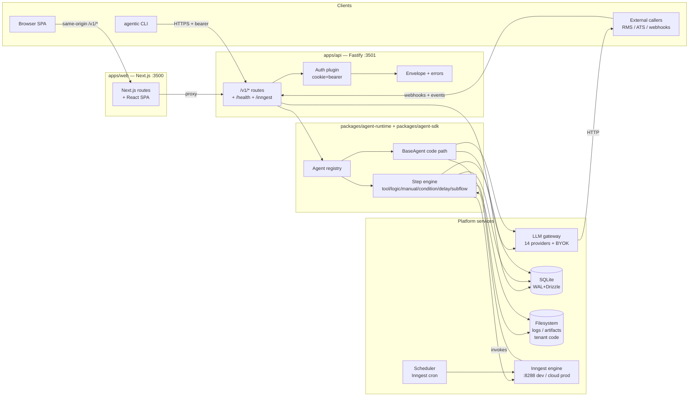

# DESIGN — Agentic Operator

> **Version:** v2.0-DRAFT
> **Date:** 2026-05-19
> **Status:** DRAFT — for review
> **Authors:** Principal Architecture (synthesis pass over audits #1–#4)
> **Supersedes:** [`agentic-operator_v1_1/docs/DESIGN.md`](../agentic-operator_v1_1/docs/DESIGN.md) (May 2026 prototype design)
> **Companion docs:** PRD.md (the *what* and *why*), IMPLEMENTATION.md (the per-file plan).

This document is the authoritative architecture reference for the v1 build. It defines primitives, contracts, data flows, and package boundaries. It is intentionally orthogonal to the PRD (which states goals and acceptance) and to IMPLEMENTATION.md (which states file-level changes).

---

## 1. Document control

| Field | Value |
|---|---|
| **Document** | `docs/DESIGN.md` |
| **Version** | v2.0-DRAFT |
| **Date** | 2026-05-19 |
| **Status** | DRAFT (for review) |
| **Owner** | Architecture |
| **Supersedes** | `agentic-operator_v1_1/docs/DESIGN.md` (frozen May 2026 prototype) |
| **Inputs** | Audits 01–04 (`docs/audits/*`), legacy DESIGN, current source tree at `apps/`, `packages/`, `tenants/`, `models/` |
| **Out of scope here** | UI pixel parity (see PRD §FR-PORT), per-file deltas (see IMPLEMENTATION.md), product positioning (see PRD §1–3), team plan (see PRD §17) |

### Change log

- **v2.0-DRAFT** (2026-05-19): full rewrite synthesizing the four audits. Replaces the v1_1 monolith design with a primitive-first architecture and an explicit harness contract.
- **v1.1** (2026-05-16): prototype design captured at handoff; preserved at `agentic-operator_v1_1/docs/DESIGN.md`.

### Conventions

- ID prefixes used in cross-references with the PRD: `FR-PORT-*` (frontend port), `FR-API-*` (HTTP surface), `FR-RUNTIME-*` (agent runtime), `FR-OS-*` (Agent OS primitives), `NFR-*` (non-functional). This document uses these as placeholders; final IDs are owned by the PRD.
- `file:line` references anchor every load-bearing claim to a source artifact.
- Audit references are inline (e.g. *Audit #3 §5.4*).
- Where the legacy design and the audits disagree, the audit wins and the divergence is called out.

---

## 2. System overview

### 2.1 Elevator

Agentic Operator is a multi-tenant **agent operating system** built on three substrates: **Inngest** for durable event-driven execution, **SQLite (Drizzle)** for typed metadata with a clear Postgres migration path, and a **14-provider LLM gateway** with failover, tool-use, and per-tenant BYOK. Agents come in two kinds — **manifest** (declarative JSON workflows) and **code** (typed TypeScript classes) — sharing a single runtime, ledger, and observability portal. The platform's job is durability, isolation, and visibility; the user's job is writing prompts, tools, and orchestration logic.

### 2.2 High-level architecture (current target)



**Notes.**
- The original v1_1 diagram colocated the portal and the runtime in a single Next.js process. The v2 split — Next.js as a *thin web tier* fronting Fastify — is the canonical split (cf. *Audit #2 §2.1*).
- Inngest is the durable substrate; it owns retries, replays, sleeps, and concurrency keys. The platform's step engine is a thin shim over `step.run()`.
- All cross-process data flows through HTTP. There is no shared in-memory state between web and api.
- Tenant code today lives under `tenants/<slug>/`, statically imported by `apps/api`. The v1 deploy story dynamic-imports from `data/tenants/<slug>/<version>/` (§11.3).

### 2.3 Why this shape

| Decision | Reason | Audit ref |
|---|---|---|
| Next.js + Fastify (not Next-only) | Fastify gives us first-class hooks, plugins, native better-sqlite3, and an explicit `:3501` boundary for the API. Mixing API + SSR is the v1_1 misstep. | #2 §2.1 |
| Inngest as the durable substrate | Memoized `step.run`, `waitForEvent`, concurrency keys, replay, dead-letter — all production-shaped on day one. | #3 §9, #4 §3 |
| SQLite + Drizzle for v1 | One-process operator deployment; Postgres swap is a 1-day Drizzle adapter change. | legacy §15, #2 §4 |
| Two AgentKinds | Manifest covers ~70% of pipelines; code covers the 30% that needs type-safety. The wedge of the product. | #4 §12 |
| Per-tenant directories | Isolation by file-tree (`tenants/<slug>/`, `data/artifacts/<runId>/`, `data/logs/<tenant>/`). | #2 §7 |
| 14-provider LLM gateway | Real customers pin providers per workload. Lazy adapters keep startup cost low. | #3 §5 |

---

## 3. Process & deployment topology

### 3.1 Development

```
┌──────────────────────────────────────────────────────────┐
│  $ pnpm dev   (concurrently)                              │
│                                                            │
│   ┌────────────────┐  ┌────────────────┐  ┌────────────┐  │
│   │ apps/web :3500 │  │ apps/api :3501 │  │ inngest    │  │
│   │ next dev       │  │ tsx watch      │  │  :8288/dev │  │
│   │ (Turbopack)    │  │ (Fastify)      │  │            │  │
│   └────────┬───────┘  └────────┬───────┘  └─────┬──────┘  │
│            │ same-origin       │                │         │
│            └───── /v1/* ───────┘ ◀── /inngest ──┘         │
└──────────────────────────────────────────────────────────┘
```

- `predev` (root `package.json:11`) hard-kills `:3500 :3501 :8288 :8289 :50052 :50053` before each run. A sharp tool — necessary on shared dev boxes; not used in prod (*Audit #2 §2.3*).
- Hot reload: Next.js Turbopack covers the web tier. `tsx watch` restarts Fastify on file change but does **not** hot-reload Inngest function registrations — those re-register only at boot (*Audit #2 §5.3*). This is acceptable for v1 dev; manifest hot-reload is on the roadmap (PRD §FR-OS-HOTRELOAD).
- Healthcheck contracts (dev parity with prod, §3.2): `GET /health` returns 200 if DB ping + Inngest reachable + LLM gateway initialized. Returns 503 if any subsystem fails. Today's `/health` matches this shape (`apps/api/src/routes/health.ts:12`).

### 3.2 Production

Three logical services, deployable as three containers or co-located in one (operator's choice):

| Service | Process | Port (default) | Scale model | Healthcheck |
|---|---|---|---|---|
| **web** | Next.js standalone bundle | `3500` | Stateless, horizontal | `GET /health` (proxied to api) |
| **api** | Fastify (tsx or `node dist/server.js`) | `3501` | Stateful (SQLite local FS); horizontal needs Postgres + shared FS for artifacts | `GET /health` |
| **inngest-worker** | The same `api` process, or a separate Node process running only Inngest serve | `3501/inngest` | Horizontal once stateless (Postgres + S3) | inspected via Inngest dashboard |
| **scheduler** | Owned by Inngest Cloud (or self-hosted Inngest) | n/a | n/a | n/a — pushed by Inngest |

**v1 deployable shape (single-tenant operator, one box):**

```
                      ┌──────── reverse proxy (nginx / caddy / Cloudflare) ────────┐
                      │     TLS termination · static caching · WAF                  │
                      └───────────────┬────────────────────────────┬────────────────┘
                                      │                            │
                          web :3500 ──┘                            └── api :3501
                                                                          │
                                                          ┌───────────────┼─────────────┐
                                                          ▼               ▼             ▼
                                                    /data/agentic.db   logs/   artifacts/
                                                    (WAL)              files   files
                                                          │
                                                          └── outbound HTTPS to Inngest Cloud (or self-host)
```

**Required contracts for production readiness** (*Audit #2 §13 #4*):

1. A **Dockerfile** (Node 26-alpine, pnpm 11, `better_sqlite3.node` resolved via `AGENTIC_SQLITE_BINDING`, tini for signals, `pnpm db:migrate` on first boot).
2. A **SIGTERM handler** that calls `app.close()` (drains in-flight requests) then `closeDb()`.
3. **Healthchecks**: liveness (`GET /health`), readiness (DB + Inngest + LLM gateway up).
4. **Migrations on boot** — see §13.3.

### 3.3 Per-tenant resource sharing

- **v1:** All tenants share one Node process; tenant code runs in the same V8 isolate (*Audit #4 §6*). Acceptable for self-host single-customer or trusted multi-tenant deployments; **not** acceptable for adversarial SaaS multi-tenancy.
- **v2 (planned, PRD §FR-OS-SANDBOX):** tenant tools/prompts run in a forked Node `worker_thread` or `vm2` isolate, communicating over postMessage. The contracts in §11 are written so this is a swap, not a rewrite.

### 3.4 Two parallel data planes — consolidating

The legacy `apps/web/app/api/spa/bootstrap/route.ts` synthesizes mock data from `models/RAAS-v1/*.json` (*Audit #2 §12.2*). The v2 design deletes that route. All SPA reads go through `/v1/*` directly. Migration steps live in IMPLEMENTATION.md.

---

## 4. The harness contract — central abstraction

The **harness contract** is the single most important seam in the system. It defines what the platform provides and what the user writes. Type signatures here are normative; the schemas live in `@agentic/contracts` and `@agentic/agent-sdk`.

### 4.1 What the platform provides

| Capability | Surface | Source of truth |
|---|---|---|
| Durable execution | One Inngest function per `(tenant, agent)`, memoized `step.run`, retries=3 (configurable), concurrency keyed by `event.data.subject` | `packages/agent-runtime/src/register.ts` (renamed from `packages/runtime`) |
| Run / step / event ledger | `runs`, `steps`, `events`, `tasks`, `artifacts`, `audit_log` Drizzle tables + file-backed payload sidecars | `packages/db/src/schema.ts` |
| LLM gateway | `LLMGateway.chat()` with `tools[]`/`tool_calls[]` support, failover across `providers[]`, BYOK lookup | `packages/llm-gateway/src/gateway.ts` |
| Tool registry | Platform tools (`http.fetch`, `channel.publish`, etc.) + per-tenant `defineTool({...})` | `packages/tools/`, `tenants/<slug>/src/tools/` |
| Trigger system | Event triggers (Inngest), cron triggers (Inngest scheduled events), webhook triggers, manual triggers | §7 |
| Scheduler | Inngest cron via `inngest.send` from a cron trigger | §7.2 |
| Observability | Pino structured logs, file-backed run logs (SSE-tailable), `runs`/`steps` rows with token+cost attribution | §16 |
| Auth / tenancy | Cookie + bearer auth, every query tenant-scoped, audit log writes on every state change | §17 |
| Deployment | `POST /v1/agents` (atomic manifest deploy), `POST /v1/deployments/:id/rollback` (atomic flip), CLI `agentic deploy` | §11.3, §14 |
| Replay | `POST /v1/events/:id/replay`, `POST /v1/runs/:id/replay` (deterministic input reconstruction) | §7.4 |

### 4.2 What the user writes

| Artifact | Where it lives | Format | Contract |
|---|---|---|---|
| **Manifest agent** | `models/<slug>/workflow_v1.json` (today) → `tenants/<slug>/manifests/` (v1) | JSON conforming to `WorkflowManifestSchema` (§10) | `id, name, actor, trigger[], actions[], triggered_event[]` + optional `input_data`, `ontology_instructions`, `tool_use`, `typescript_code`, `schedule` |
| **Code agent** | `tenants/<slug>/src/agents/*.ts` (v1; today system agents live in `packages/agents/src/system/`) | TypeScript class extends `BaseAgent<TInput, TOutput>` | `name, description, buildMessages(input, ctx), optional parseOutput, optional getTools` |
| **Tool** | `tenants/<slug>/src/tools/*.ts` | `defineTool({ name, description, input?, output?, handler(ctx) })` | Typed input + output Zod schemas, async handler |
| **Prompt** | `tenants/<slug>/src/prompts/*.ts` | `definePrompt({ name, system?, template(ctx), output?, jsonMode? })` | Returns assembled `ChatMessage[]` and optional structured-output schema |
| **Tenant registry** | `tenants/<slug>/src/index.ts` | Default export `TenantRegistry = { tools, prompts, agents? }` | Discoverable by name |

### 4.3 The contract between them

```ts
// packages/agent-sdk/src/types.ts — public, user-facing

export interface ToolContext {
  tenantSlug: string;
  agentName: string;
  actionName: string;
  runId: string;
  stepId: string;
  subject?: string;
  correlationId: string;
  event?: { name: string; data: Record<string, unknown> };
  lastResult?: unknown;
  // v1 additions:
  ontologyInstructions?: string;
  memory: MemoryHandle;       // (§5.7 v1.1 / v2)
  logger: Logger;
}

export interface ToolResult<T> {
  ok: boolean;
  data?: T;
  error?: { code: string; message: string; hint?: string };
  meta?: Record<string, unknown>;
}

export interface ToolDescriptor<TInput = unknown, TOutput = unknown> {
  kind: "tool";
  name: string;
  description?: string;
  input?: z.ZodType<TInput>;
  output?: z.ZodType<TOutput>;
  handler: (ctx: ToolContext, input: TInput) => Promise<ToolResult<TOutput>>;
}

export interface PromptDescriptor<TOutput = string> {
  kind: "prompt";
  name: string;
  system?: string;
  template: (ctx: ToolContext) => ChatMessage[];
  output?: z.ZodType<TOutput>;
  jsonMode?: boolean;
}

export abstract class BaseAgent<TInput = unknown, TOutput = string> {
  abstract name: string;
  abstract description: string;
  enabled = true;
  defaultProvider?: ProviderId;
  defaultModel?: string;
  outputSchema?: z.ZodType<TOutput>;      // v1: feeds gateway jsonMode + repair-retry loop
  maxSteps = 1;                            // v1.1: tool-use loop honored
  concurrency: { limit: number; key?: string } = { limit: 4 };

  abstract buildMessages(input: TInput, ctx: ToolContext): ChatMessage[] | Promise<ChatMessage[]>;
  getTools?(ctx: ToolContext): ToolDescriptor[];   // v1.1
  parseOutput?(text: string, ctx: ToolContext): TOutput | Promise<TOutput>;
}
```

**This is the surface a user codes against.** Everything else — registries, run engines, Inngest wiring, audit log — is platform internal.

### 4.4 Event protocol

A platform event has a stable JSON shape:

```ts
export interface PlatformEvent {
  id: string;                          // "evt-<12hex>"
  tenantSlug: string;                  // owner
  name: string;                        // e.g. "REQUIREMENT_LOGGED" (canonical, no tenant prefix)
  inngestName: string;                 // e.g. "raas/REQUIREMENT_LOGGED" (with prefix; for Inngest only)
  category?: string;                   // optional taxonomy bucket
  subject?: string;                    // e.g. "CAN-88412"
  sourceAgentId?: string;              // if emitted by an agent
  correlationId: string;               // threaded across chains
  receivedAt: string;                  // ISO timestamp
  payloadRef: string;                  // path#offset into NDJSON ledger
}
```

External callers `POST /v1/events { name, subject, payload }` and receive `{ event_id }`. Inngest routes by `${tenantSlug}/${name}`. The ledger is append-only NDJSON with byte-offset references (legacy §6, *Audit #3 §10.2*).

### 4.5 Status snapshot per capability

Reproduced and updated from *Audit #4 §3*. Status reflects v1 *target*, with current state in parentheses.

| Capability | v1 target | Current | Audit ref |
|---|---|---|---|
| Event trigger | YES | YES | #4 §3 |
| Durable run | YES | YES | #4 §3 |
| Tool dispatch (manifest) | YES | YES | #4 §3 |
| LLM call | YES (with tools) | YES (no tools) | #3 §5.4 |
| Code-agent single-shot | YES | YES | #4 §3 |
| Tool-use loop | YES (v1.1) | NO | #3 §5.4 |
| Manual / HITL | YES | YES | #4 §3 |
| Schedule / cron | YES | NO | #4 §3 |
| Webhook ingest | YES | PARTIAL | #2 §3, #4 §3 |
| Sub-agent invoke | YES (v1.1) | NO | #4 §3 |
| Memory primitive | YES (v1.1) | NO | #3 §8 |
| Per-tenant BYOK | YES (v1.1) | NO | #3 §5.5 |
| Cost caps | YES | NO | #4 §13 |
| Streaming responses | DEFERRED (v2) | NO | #3 §5.3 |
| Replay | YES | PARTIAL | #4 §3 |
| Audit log | YES (every mutation) | PARTIAL | #4 §9 |
| Sandbox tenant code | DEFERRED (v2) | NO | #4 §6 |

---

## 5. Primitives — the platform vocabulary

The platform speaks in eleven primitives. Each has a purpose, type signature, lifecycle, and persistence story.

### 5.1 Agent

**Purpose.** A unit of agentic work. Either declarative (manifest) or imperative (code).
**Discriminator.** `kind: "manifest" | "code"`.
**Identity.** `(tenantId, workflowId, kebabId)` — globally unique slug-style id; `kebabId` is the stable handle across renames.
**Lifecycle.**
1. Authored on disk (manifest JSON or TS class).
2. Discovered at boot (`bootstrapTenant`) or uploaded via `POST /v1/agents` / CLI.
3. Persisted in `agents` + `agent_versions`.
4. Registered as an Inngest function (manifest: always; code: as of v1.1, see §11.4).
5. Invokable via event, schedule, webhook, or manual `POST /v1/agents/:name/invoke`.
6. Versioned, deployed atomically, rolled back (§9).

**Persistence.** `agents` row (immutable identity), one `agent_versions` row per uploaded version, one `deployments` row per promotion. Run pinning: `runs.agentVersionId` is set at run start (legacy §9, *Audit #4 §9*).

### 5.2 Workflow

**Purpose.** A named set of agents and the events that connect them. Tenant-scoped.
**Identity.** `(tenantId, slug)`.
**Composition.** A workflow does not enforce ordering; ordering emerges from agent triggers and emitted events. The DAG is **derived**, not declared (cf. `GET /v1/workflows/dag`).
**Lifecycle.**
1. Created implicitly by the first manifest uploaded into a tenant.
2. Each upload appends a `workflow_versions` row with the full manifest JSON.
3. A `deployments` row with `target='workflow'` flips the live pointer.
**Persistence.** `workflows`, `workflow_versions`, `deployments` tables.

### 5.3 Trigger

**Purpose.** A source of run-creation events.
**Kinds:**
- `event` — Inngest event named `${tenantSlug}/${name}`.
- `schedule` — cron expression; the platform's scheduler emits `${tenantSlug}/__schedule.${agentName}` at the configured cadence (§7.2).
- `webhook` — `POST /v1/webhooks/:provider` with HMAC verification → translator → emit Inngest event (§7.3).
- `manual` — `POST /v1/agents/:name/invoke` (sync) or `POST /v1/events` (async).
- `subagent` — programmatic invocation from another agent (§7.5).

**Persistence.** Manifest `trigger[]` field; code agents declare via `getTriggers()` or a separate registration call. Webhook and schedule triggers also write rows in `event_subscriptions` (new in v1) for routing.

### 5.4 Event

**Purpose.** An immutable, typed, append-only fact in the ledger.
**Schema.** See §4.4.
**Lifecycle.**
1. Created by external `POST /v1/events`, webhook ingest, scheduler tick, or agent emit (`step.sendEvent`).
2. Validated against `event_types` registry if strict mode is enabled.
3. Inserted into `events` row, payload appended to `logs/<tenant>/events/<date>.ndjson`, byte offset stored in `payload_ref`.
4. Inngest `client.send(...)` notified.
5. Fan-out to all registered listeners (Inngest's job).
**Persistence.** `events` table + NDJSON ledger files.

### 5.5 Run

**Purpose.** One invocation of one agent. Has lifecycle, status, and a step log.
**Schema:**
```ts
runs: {
  id: "run-<12hex>",
  tenantId, agentId, agentVersionId, triggerEventId,
  status: "running" | "ok" | "failed" | "cancelled",
  startedAt, endedAt, durationMs,
  tokensIn, tokensOut, model, provider,    // aggregated across steps
  emittedEventId, errorMessage,
  logPath: "logs/<tenant>/runs/<date>/<runId>.log",
  correlationId, subject,
  parentRunId  // NEW v1 — for sub-agent trace trees (Audit #4 §15 #9)
}
```
**Lifecycle.**
1. Inserted on first `step.run("init")` (memoized).
2. Each step appends a `steps` row.
3. On success: `status='ok'`, `endedAt` set, `emittedEventId` populated.
4. On failure: `status='failed'`, `errorMessage` populated.
5. After grace window: log file rotated/gzipped (§16); artifacts remain until retention sweep.
**Persistence.** `runs` row + per-run log file + per-step artifact JSON sidecars.

### 5.6 Step

**Purpose.** One durable unit of work within a run.
**Schema:**
```ts
steps: {
  id, runId, ord,
  name, type,                  // tool | logic | manual | condition | delay | subflow
  status: "running" | "ok" | "failed" | "skipped",
  startedAt, endedAt, durationMs,
  inputRef, outputRef,         // path#offset into artifact files
  error,
  provider, model, tokensIn, tokensOut    // for LLM steps
}
```
**Lifecycle.** Wrapped in Inngest `step.run(name, body)`. Body is memoized: the return value is stored by Inngest, replays return cached. **Side effects in the body are NOT memoized** — DB inserts inside a step body must be idempotent (use `INSERT … ON CONFLICT`) — see *Audit #3 §4.5*.
**Persistence.** `steps` row + input/output JSON sidecars under `data/artifacts/<runId>/step-<ord>-{input,output}.json`.

### 5.7 Tool

**Purpose.** A named function exposed to either the step engine (manifest agents) or the LLM (code agents with tool-use).
**Definition.** `defineTool({...})` returns a `ToolDescriptor` (§4.3).
**Resolution order** (manifest `type: "tool"` action):
1. Tenant registry `registry.tools[action.name]` (typed handler).
2. Generic platform tool registry (`@agentic/tools`) — `http.fetch`, `channel.publish`, etc.
3. Hint-guessed fallback (legacy; deprecated in v1).
**LLM tool-use.** A code agent's `getTools()` returns a `ToolDescriptor[]` that the gateway translates to provider-native shapes (Anthropic `tools[]`, OpenAI `tools[]`). The loop is bounded by `agent.maxSteps` (*Audit #3 §6.4*).
**Persistence.** Tool definitions live in source. Tool *invocations* land as `steps` rows.

### 5.8 Prompt

**Purpose.** Assembled `ChatMessage[]` for an LLM call, optionally with a structured-output schema.
**Definition.** `definePrompt({...})` returns a `PromptDescriptor` (§4.3).
**Composition order** (the auto-built path for manifest `logic` actions — see §8):
1. Agent's `ontology_instructions` (system role).
2. Agent's `description` + action's `description` (system role).
3. Prompt template's `system` if provided.
4. Structured-output schema as JSON Schema in system instructions if `output` is set.
5. `lastResult` marshalled as JSON in a system/user role.
6. `input_data` bindings from event payload.
7. User template output.

**Persistence.** Prompt source lives in tenant code. *Prompt versioning as DB rows is deferred to v2* (*Audit #3 §7.5*).

### 5.9 Task

**Purpose.** A human-gated work item.
**Schema:**
```ts
tasks: {
  id, tenantId, runId, type, title,
  awaitingRole, awaitingUserId, priority,
  status: "open" | "resolved" | "snoozed",
  createdAt, resolvedAt, resolvedBy,
  payloadJson, resolutionJson
}
```
**Lifecycle.** Created when a manifest `manual` step is reached; the Inngest function awaits `task.resolved` via `step.waitForEvent` (timeout 7d default, manifest-overridable in v1). Operator clicks Approve/Reject in the portal → `POST /v1/tasks/:id/resolve` → emits `task.resolved` event with the task id → Inngest function resumes.
**Persistence.** `tasks` table.

### 5.10 Deployment

**Purpose.** An immutable promotion record. Pins which `*_version` is live for a given target.
**Schema:**
```ts
deployments: {
  id, tenantId, target: "workflow" | "agent" | "runtime" | "code_agent",
  versionId, status: "live" | "rolled_back" | "pending",
  deployedBy, deployedAt, note
}
```
**Lifecycle.**
1. Created by manifest upload (`POST /v1/agents`), CLI deploy, or code-agent bootstrap.
2. New deployment in a transaction: prior live row flipped to `rolled_back`; new row inserted as `live`; Inngest function re-registered atomically (v1 fix; *Audit #4 §5.4*).
3. Rollback via `POST /v1/deployments/:id/rollback` re-flips the live pointer and re-registers.
4. **In-flight runs are unaffected** — pinned to their `agentVersionId`.

**Persistence.** `deployments` table. v1 adds a partial unique constraint `WHERE status='live'` to prevent two live rows for the same target (*Audit #2 §4 issue*).

### 5.11 Tenant

**Purpose.** Isolation boundary. Owner of every artifact above.
**Schema:**
```ts
tenants: { id, slug, name, createdAt }
memberships: { userId, tenantId, role: "admin"|"operator"|"viewer" }
api_tokens: { id, tenantId, hash, name, scopes, createdAt, lastUsedAt, expiresAt }
```
**Identity propagation.** `X-Tenant-Slug` header + JWT/cookie tenant claim must match — server enforces (*Audit #2 §13 #1*).
**Reserved slug.** `__system` is owned by the platform for code agents shipped in `apps/api/src/agents/` (formerly `packages/agents/src/system/`). Cross-tenant fallback to `__system` runs is **removed** in v1 (the leak described in *Audit #2 §7.5*).

---

## 6. AgentKind taxonomy

Two kinds coexist on one runtime.

### 6.1 `code` agents

**Where they live (v1):** `tenants/<slug>/src/agents/<name>.ts` (tenant-scoped) or `apps/api/src/agents/<name>.ts` (platform-scoped, under `__system`). The old location `packages/agents/src/system/` is moved out of the platform package tree per *Audit #4 §15 #2*.

**Shape:**

```ts
export class TestAgent extends BaseAgent<{ message: string }, string> {
  name = "testAgent";
  description = "Sanity check for the LLM gateway.";
  defaultProvider: ProviderId = "mock";
  buildMessages({ message }, ctx) {
    return [
      { role: "system", content: "You are an Agentic Operator smoke test." },
      { role: "user", content: message },
    ];
  }
}
```

**Use when:**
- The agent needs full TypeScript expressiveness (complex prompt assembly, custom retry logic, dynamic message building).
- Type-safe input/output is required.
- Single-shot or tool-use loop, not a long pipeline.

**Examples (target state):**
- `testAgent` (platform smoke test).
- `resumeScorer` (code-defined, scores resume JSON against rubric, returns structured `Score`).

**Runtime contract (v1):**
- Sync invocation: `POST /v1/agents/:name/invoke` → run executes inline, response in 1 request/response (`packages/agent-runtime/src/run-engine.ts`).
- Async invocation (**v1**, picked Path A in cross-review pass): `POST /v1/agents/:name/invoke?async=1` → enqueues an Inngest event `__system/code.${name}.invoke`, returns `{ runId }` immediately. Code agents register as Inngest functions on bootstrap; see [IMPLEMENTATION P1-RT-08](IMPLEMENTATION.md#57-code-agent-harness-structured-output-cli).

### 6.2 `manifest` agents

**Where they live (v1):** `tenants/<slug>/manifests/workflow_v1.json` (with `actions_v1.json` sidecar). The legacy `models/<slug>/` directory is migrated to this path; see IMPLEMENTATION.md.

**Shape:**

```jsonc
{
  "id": "10",
  "name": "matchResume",
  "title": "Match Resume",
  "description": "Score a parsed resume against a JD.",
  "actor": ["Agent"],
  "trigger": ["RESUME_PROCESSED"],
  "actions": [
    { "order": "1", "name": "validateBlacklist", "type": "logic", "description": "...", "condition": "lastResult.parsed === true" }
  ],
  "triggered_event": ["MATCH_PASSED_NEED_INTERVIEW", "MATCH_PASSED_NO_INTERVIEW", "MATCH_FAILED"],
  "input_data": { "candidate_id": "Candidate id from event.data.subject" },
  "ontology_instructions": "You are evaluating recruiting candidates.",
  "tool_use": [],
  "schedule": null
}
```

**Use when:**
- The workflow is a linear or near-linear pipeline of LLM calls and tools.
- Non-engineers should be able to author or edit.
- Branching outcomes are needed (today's `triggered_event[0]`-only behavior is fixed in v1; see §7.6).

**Runtime contract:** one Inngest function per `(tenant, agentName)`, registered at boot or atomic deploy. Steps run via the step engine (§8).

### 6.3 Unified runtime contract

Both kinds produce the same shape of `AgentResult`:

```ts
export interface AgentResult {
  runId: string;
  status: "ok" | "failed";
  startedAt: string;
  endedAt: string;
  durationMs: number;
  tokensIn: number;
  tokensOut: number;
  provider: ProviderId;
  model: string;
  emittedEventId?: string;
  output?: unknown;       // structured if schema present, else string
  error?: { code: string; message: string };
}
```

And both write the same DB rows: `runs` + `steps` + per-step artifacts + `audit_log` (on state-changing operations). Differences eliminated in v1:

| Concern | v1_1 (today) | v1 (target) |
|---|---|---|
| Engine | code path: `packages/agents/run-engine.ts` · manifest path: `packages/runtime/register.ts` | Single `packages/agent-runtime/run-engine.ts` with kind dispatcher. Refinement #3 from *Audit #4*. |
| Model column | code: `response.model` · manifest: hardcoded `"mock-model-v1"` | Always `response.model` (fix: *Audit #3 §15 #5*) |
| Inngest registration | manifest: yes · code: no | Both registered as Inngest functions (sync inline path still allowed for `?async=0`) |
| Artifact writes | code: yes · manifest: no | Both write step-input/output sidecars |

---

## 7. Trigger model

### 7.1 Event trigger (today + v1)

**Inngest event** named `${tenantSlug}/${name}`. Agent's manifest `trigger: ["REQUIREMENT_LOGGED"]` becomes:

```ts
inngest.createFunction(
  { id: `${tenantSlug}.${agentName}`, concurrency: { limit: 8, key: "event.data.subject" }, retries: 3 },
  agent.trigger.map(name => ({ event: `${tenantSlug}/${name}` })),
  handler
);
```

Fan-out is implicit: every agent listening for the event fires in parallel. Per-subject ordering preserved via concurrency key.

### 7.2 Scheduled trigger (v1, NEW)

**Manifest:**

```jsonc
{ "name": "nightlyReport", "schedule": "0 2 * * *", "trigger": [], "actions": [...] }
```

**Implementation:**
1. Bootstrap detects `schedule` field, registers an Inngest scheduled function with the cron expression.
2. The scheduled function `inngest.send({ name: "${tenantSlug}/__schedule.${agentName}" })`.
3. The agent's normal Inngest function listens for `__schedule.${agentName}` in addition to its `trigger[]`.

This keeps the scheduler stateless and reuses Inngest's cron primitive (*Audit #4 §13 #6*).

### 7.3 Webhook trigger (v1, hardening)

**Today:** `POST /v1/webhooks/:provider` exists with HMAC verification but tenant resolution is hardcoded to `AGENTIC_DEV_TENANT` (*Audit #2 §7.6*).

**v1 design:**

```
POST /v1/tenants/:slug/webhooks/:provider
   ↓
HMAC verify against per-tenant secret in webhook_subscriptions table
   ↓
Timestamp check (±5 min, reject if outside)
   ↓
Anti-replay: check nonce/event-id against webhook_seen (TTL'd) table
   ↓
Provider-specific translator → emits Inngest event
```

**Schema additions:**

```ts
webhook_subscriptions: {
  id, tenantId, provider, secretEncrypted,
  eventName,                  // canonical event to emit
  translatorId,               // points at a registered translator function name
  enabled, createdAt
}
webhook_seen: { tenantId, provider, externalId, seenAt }   // TTL'd 24h
```

**Translator registry:** platform ships translators for common providers (Stripe, GitHub, Slack); tenants can register custom translators via tenant code (`defineWebhook({ provider, verifySignature, translateToEvent })`).

### 7.4 Manual trigger

**`POST /v1/agents/:name/invoke`** — sync invocation, body validated against agent's input schema (if declared). Returns `AgentResult` (§6.3).

**`POST /v1/events`** — async invocation by posting an event; the listening agent(s) run via Inngest.

**Replay:**
- `POST /v1/events/:id/replay` — re-emit the original event with a new id, preserving payload and correlation id.
- `POST /v1/runs/:id/replay` — re-emit the trigger event; deterministic reconstruction.
- v1 fix: replay id generation uses `makeId("evt")`, not `Date.now()` concat (*Audit #2 §3 issue*).

### 7.5 Sub-agent trigger

**Split per cross-review:**
- **Manifest `subflow` step — v1** (ships in [IMPLEMENTATION P1-RT-03](IMPLEMENTATION.md#53-new-step-types)). A manifest action with `type: "subflow"` and `agent: "<name>"` invokes another agent and threads its result as `lastResult`. `runs.parentRunId` populated.
- **Code-agent `this.invoke(...)` — v1.1.** The full programmatic invocation primitive shown below is post-launch; v1 covers the manifest path only.

A code agent (v1.1) can invoke another agent:

```ts
const result = await this.invoke("matchResume", { candidateId: "CAN-88412" }, ctx);
```

**Implementation:**
1. The platform looks up the live `agent_version` for the named agent in the caller's tenant (or `__system`).
2. Emits an internal event `${callerTenant}/__subagent.${calleeName}` with `parentRunId: ctx.runId`, `correlationId: ctx.correlationId`.
3. Inngest invokes the callee's function, which runs as normal and writes `runs.parentRunId`.
4. The caller awaits the callee's run via `step.waitForEvent('subagent.completed', if: 'async.data.parentRunId == "${ctx.runId}"', timeout: '5m')`.

**Trace tree:** The portal renders `parentRunId` as a nesting affordance — sub-runs appear indented within their parent run on the Run detail view (*Audit #4 §15 #9*).

### 7.6 Branching emit (v1, FIX)

**Today:** manifest agents always emit `triggered_event[0]`, regardless of the step output. This breaks any agent with multiple outcomes (e.g. `matchResume` declares three) — *Audit #3 §9.1 #4* marked critical.

**v1 fix:** the last action's output can declare which event to emit:

```ts
// step output convention
{ __event: "MATCH_PASSED_NEED_INTERVIEW", ...rest }
```

If `__event` is absent, fall back to `triggered_event[0]` for backward compatibility. The step engine reads this discriminator at emit time (`packages/agent-runtime/src/register.ts` finalize step).

For declarative authors who don't want to write code in `logic` actions, the manifest can also declare per-action `emits` (a single event name):

```jsonc
{ "name": "branchMatch", "type": "logic", "emits": "MATCH_PASSED_NEED_INTERVIEW", ... }
```

---

## 8. Step engine

### 8.1 Step types

| Type | Today | v1 | Purpose |
|---|---|---|---|
| `logic` | LLM call (with auto-built prompt fallback) | LLM call with proper context assembly (§5.8) | Reasoning / generation |
| `tool` | Tenant tool → generic fallback → hint-guessed mock | Tenant tool → registered platform tool → fail | Side effect (HTTP, DB, channel publish) |
| `manual` | Creates `tasks` row + `step.waitForEvent` | Same; `task_timeout_s` honored from manifest | Human approval |
| `condition` *(v1, NEW)* | n/a | Evaluates a guard expression against `lastResult` + `event.data`; skips downstream actions if false | Conditional execution (replaces today's ignored `action.condition`) |
| `delay` *(v1, NEW)* | n/a | `step.sleep(duration)` | Wait |
| `subflow` *(v1.1, NEW)* | n/a | Invoke another manifest agent as a child run (§7.5) | Decomposition |

**`condition` evaluator design.** A small jsonata-style sandboxed expression language (or a curated whitelist over `lastResult` + `event.data` paths). The full expression `"客户需求管理系统可正常访问"` from RAAS manifests (a Chinese natural-language pre-condition) is **not** evaluatable; it remains documentation. The runtime distinguishes machine-evaluable `guard` vs. human-only `documentation_condition` (*Audit #3 §4.3*).

### 8.2 Execution model

Each step is exactly one `step.run`. Memoization is at the **return value** level — Inngest does not replay side-effects in the body. The platform's discipline:

1. **Step body returns are idempotent.** Use deterministic ids (`runId + step ord`), `INSERT … ON CONFLICT DO NOTHING` on side-effect rows.
2. **Step body is pure-ish.** DB writes inside use `db.transaction(() => { ... })` so partial work isn't visible on retry.
3. **`step.sendEvent` is outside `step.run`** — Inngest handles dedup by the event's id.

### 8.3 Error → retry → dead-letter

```
step throws
  ↓
step row status='failed', error set
  ↓
re-throw → Inngest function throws
  ↓
Inngest retries (up to N, default 3, exponential backoff)
  ↓
on final failure: function status='failed'
  ↓
runs row status='failed', errorMessage set
  ↓
emit __dead_letter.${agentName} event (NEW v1)
  ↓
operator sees in portal; can POST /v1/runs/:id/replay
```

v1 honors per-action overrides (*Audit #3 §15 #6*):
- `action.retries: N` → `step.run(name, { retries: N }, body)` if Inngest supports per-step (otherwise mapped to function-level for the dominant step).
- `action.timeout_s: T` → wrap step body in `AbortSignal.timeout(T * 1000)`.

### 8.4 Conditional execution (v1, FIX)

`action.condition` is parsed today but never evaluated (*Audit #3 §4.3*). v1 makes it real:

1. If `action.guard` (new field, machine-evaluable) is set, evaluate against `{ lastResult, event, ctx }`.
2. If false → step row inserted with `status='skipped'`, no LLM call, `lastResult` unchanged for next step.
3. If true or absent → execute normally.

### 8.5 Idempotency via correlation id

`correlation.ts` already threads `__correlationId` through events. v1 additions:
- `__triggerEventId` — Inngest dedup key on outbound `step.sendEvent`; same external trigger posted twice produces one run.
- `parentRunId` — surfaced on every sub-run for tree visualization (§7.5).

### 8.6 Branching emit (the fix)

Per §7.6, the finalize step in `register.ts` reads `lastResult.__event` and emits the matching `triggered_event[]` member; defaults to `triggered_event[0]`. Validation: at bootstrap, assert that any `__event` value referenced in an action's `emits` is a member of `triggered_event[]`.

---

## 9. LLM gateway

### 9.1 Provider abstraction

```ts
export type ProviderId =
  | "anthropic" | "openai" | "openrouter" | "groq" | "together"
  | "mistral" | "deepseek" | "qwen" | "custom"
  | "gemini" | "azure" | "mock" | "bedrock" | "vertex";

export interface LLMGateway {
  chat(req: ChatRequest): Promise<ChatResponse>;
  // v2: chatStream(req: ChatRequest): AsyncIterable<ChatChunk>;
  hasProvider(p: ProviderId): boolean;
  listProviders(): ProviderInfo[];
  listModels(p: ProviderId): ModelInfo[];
  // v1 NEW:
  resolveKeysForTenant(tenantSlug: string): Map<ProviderId, string>;   // BYOK
}
```

Adapters live under `packages/llm-gateway/src/adapters/`. The three classes (Anthropic SDK, OpenAI-compatible, others) keep their current shape (*Audit #3 §5.1*).

### 9.2 Tool-use loop (v1, NEW)

Today `ChatMessage.content: string` cannot carry tool-use blocks (*Audit #3 §5.4*). v1 widens:

```ts
export type ChatMessage =
  | { role: "system" | "user"; content: string }
  | { role: "assistant"; content: string | Array<TextBlock | ToolUseBlock> }
  | { role: "tool"; content: ToolResultBlock[] };

export interface ChatRequest {
  provider?: ProviderId; providers?: ProviderId[];   // failover chain
  model?: string;
  messages: ChatMessage[];
  tools?: ToolDef[];                                  // v1 NEW
  toolChoice?: "auto" | "any" | "none" | { name: string };
  jsonMode?: boolean;
  outputSchema?: object;                              // JSON Schema; instructs the model
  maxTokens?: number;
  temperature?: number;
  timeoutMs?: number;
  signal?: AbortSignal;
  tenantSlug: string;                                 // for BYOK + cost attribution + audit
}

export interface ChatResponse {
  text: string;                                       // concatenated text blocks
  toolCalls?: ToolCall[];                             // v1 NEW
  finishReason: "stop" | "tool_calls" | "length" | "error";
  tokensIn: number; tokensOut: number;
  provider: ProviderId; model: string;
  costUsd?: number;                                   // v1 NEW (derived from PROVIDER_MODEL_CATALOG)
}
```

**The loop** (`packages/agent-runtime/src/run-engine.ts` for code agents; `step-engine.ts` for manifest):

```
for step in 1..maxSteps:
  res = gateway.chat({ messages, tools })
  if res.toolCalls.length === 0: break
  for tc in res.toolCalls:
    result = await tool.handler(ctx, tc.input)
    messages.push(assistantBlock(tc))
    messages.push(toolResultBlock(tc.id, result))
```

Each tool call lands as one `steps` row (`type: "tool"`). Each LLM call lands as one `steps` row (`type: "logic"`). `runs.tokens_in/out` aggregates across both.

### 9.3 Retries, timeouts, rate limits

Today: single retry at 250ms, then fall through provider chain. v1 hardening (*Audit #3 §5.2*):
- Exponential backoff with jitter: `min(2^attempt * 250ms, 5s) + rand(0..250ms)`.
- Per-provider rate limit detection (429 with Retry-After) → respect Retry-After; if > 30s, fall through chain.
- Per-tenant rate limit at the gateway boundary (token bucket keyed by `tenantSlug`); 429 with `cost_limit_exceeded` if over budget (§9.6).
- Per-call timeout propagated via `AbortSignal.timeout` + adapter `signal:` pass-through.

### 9.4 Streaming (v2)

`gateway.chatStream()` returns `AsyncIterable<ChatChunk>`. Plumbing for v2; the contract is reserved now to avoid breaking changes:
- New endpoint `POST /v1/agents/:name/invoke?stream=1` returns SSE.
- BaseAgent gets an optional `streamHandler(chunk)` callback.

### 9.5 Per-tenant BYOK (v1.1 — deferred per cross-review)

**Note:** Per the cross-review pass (audits/05), BYOK is deferred to v1.1; v1 uses platform-managed keys via `AGENTIC_LLM_*_API_KEY` env vars + per-tenant cost cap (§9.6). The schema and resolution order below is reserved for v1.1.

```ts
tenant_provider_keys: {
  id, tenantId, provider, keyEncrypted, keyHashPrefix,    // first 8 chars for UI display
  addedBy, addedAt, lastUsedAt, expiresAt,
  status: "active" | "revoked"
}
```

**Resolution order** at `chat()` call time:
1. `req.providers[]` ordered list — for each provider, look up tenant key; if present, use it; else fall through to platform default.
2. Platform default key (from env).
3. If no key → `LLMError("not_configured")`.

Keys encrypted at rest using libsodium with a master key from environment / KMS (*legacy §13*). UI: Settings → Keys page shows added keys (masked) and "Test" button.

### 9.6 Cost & token attribution + caps

**Today:** tokens stored on `runs` and `steps`; cost not computed.

**v1:**
- Add `cost_usd` column to `runs` and `steps`.
- Compute at LLM-call return time from `PROVIDER_MODEL_CATALOG.inP/outP`.
- Aggregate to `tenant_usage_daily(tenantId, day, tokensIn, tokensOut, costUsd)` via a daily Inngest cron.
- `tenant_budgets(tenantId, dailyUsd, monthlyUsd, dailyTokens, monthlyTokens)` table.
- Gateway pre-flight check: if next call would exceed budget → throw `LLMError("cost_limit_exceeded")` → API maps to 429.
- UI: Settings → Quotas page shows current vs. cap; alerts at 80%/100%.

### 9.7 LLMError taxonomy

Existing taxonomy at `packages/llm-gateway/src/errors.ts:9-85` is preserved and extended:

```
auth · rate_limit · timeout · model_not_found · not_configured ·
provider_error · network · bad_request ·
cost_limit_exceeded (v1 NEW) · tools_unsupported (v1 NEW)
```

Each maps to HTTP status in the route layer (*Audit #2 §6.3*).

---

## 10. Manifest schema (canonical)

This section is the normative schema. It supersedes `agentic-operator_v1_1/docs/DESIGN.md §4`.

### 10.1 WorkflowManifestSchema

```ts
// packages/agent-runtime/src/manifest.ts

export const TriggerSchema = z.array(z.string());
export const TriggeredEventSchema = z.array(z.string());

export const ActionSchema = z.object({
  order: z.string(),
  name: z.string(),
  type: z.enum(["tool", "logic", "manual", "condition", "delay", "subflow"]),   // expanded
  description: z.string().optional(),
  condition: z.string().optional(),              // human-readable, documentation
  guard: z.string().optional(),                  // machine-evaluable expression (v1 NEW)
  retries: z.number().int().min(0).max(10).optional(),
  timeout_s: z.number().int().min(1).max(3600).optional(),
  task_type: z.string().optional(),              // for manual
  task_timeout_s: z.number().int().optional(),   // for manual (v1 NEW; replaces hardcoded 7d)
  delay_s: z.number().int().optional(),          // for delay
  subflow_agent: z.string().optional(),          // for subflow
  emits: z.string().optional(),                  // per-action event selector (v1 NEW)
  tool: z.string().optional(),                   // explicit tool name (v1; replaces hint-guess)
  input: z.record(z.string(), z.unknown()).optional(),    // typed input dispatch (v1 NEW)
});

export const AgentSchema = z.object({
  id: z.string(),
  name: z.string(),
  title: z.string().optional(),
  description: z.string(),
  actor: z.array(z.enum(["Agent", "Human"])),
  trigger: TriggerSchema,
  actions: z.array(ActionSchema),
  triggered_event: TriggeredEventSchema,

  // v1: previously dropped, now persisted (Audit #3 §3.1 — the silent drop bug fix)
  input_data: z.record(z.string(), z.string()).optional(),
  ontology_instructions: z.string().optional(),
  tool_use: z.array(z.object({
    name: z.string(),
    description: z.string().optional(),
    input_schema: z.record(z.string(), z.unknown()).optional(),
  })).optional(),
  typescript_code: z.string().optional(),    // documentation slot; never eval'd (§11.4)
  schedule: z.string().nullable().optional(),    // cron expression (v1 NEW)

  // metadata
  enabled: z.boolean().default(true),
}).passthrough();   // during migration window; locks to strict in v1.1

export const WorkflowManifestSchema = z.array(AgentSchema);
```

**Migration:** the `.passthrough()` is **temporary** to allow forward-compatible extra fields during the v1 transition (today's silent-drop bug from *Audit #3 §3.1*). v1.1 removes it; explicit fields only.

### 10.2 ActionsManifestSchema (rich actions metadata)

Today `actions_v1.json` is parsed via `z.array(z.record(z.string(), z.unknown()))` — fully passthrough. v1 keeps this lenient parse (rich metadata for tooling, not consumed at runtime). The Step engine **does not** validate against `actions_v1.json` for v1; that's a v2 enhancement (*Audit #3 §16 #8*).

### 10.3 Persistence

`agent_versions.manifestJson` stores the **parsed** result. The fix from *Audit #3 §3.1*: with `passthrough()` the extra fields survive the parse and reach DB. Step engine reads `agent.ontology_instructions`, `agent.tool_use`, etc., from there.

---

## 11. Tenant code surface

### 11.1 Directory layout (v1 target)

```
tenants/<slug>/
├── package.json         (name: "@tenants/<slug>", workspace-internal)
├── agentic.json         (NEW v1 — tenant manifest, see §11.2)
├── src/
│   ├── index.ts         (default export: TenantRegistry)
│   ├── tools/<name>.ts
│   ├── prompts/<name>.ts
│   └── agents/<name>.ts (NEW v1 — per-tenant code agents)
└── manifests/
    ├── workflow_v1.json   (migrated from models/<slug>/)
    └── actions_v1.json
```

The legacy `models/<slug>/` is migrated into `tenants/<slug>/manifests/`. The split between "data" (models) and "code" (tenants) is collapsed: one tenant, one directory.

### 11.2 `agentic.json` tenant manifest (v1, NEW)

```jsonc
{
  "slug": "raas",
  "name": "Recruiting as a Service",
  "schemaVersion": 1,
  "manifests": ["manifests/workflow_v1.json"],
  "code": { "registry": "src/index.ts" },
  "createdAt": "2026-05-01"
}
```

Bootstrap reads `tenants/*/agentic.json` automatically (replaces today's hardcoded import in `apps/api/src/bootstrap.ts:14-17`, addressing *Audit #4 §15 #7*).

### 11.3 Hot reload (planned)

- **v1:** restart-on-deploy. Atomic `POST /v1/agents` writes DB rows + re-registers Inngest function in the same process via `inngest.functions.register([...])` (the Inngest SDK supports dynamic registration).
- **v1.1:** file watcher detects tenant file changes; re-bootstraps that tenant's registry; re-registers affected Inngest functions. `apps/api` uses a module-import cache invalidation pattern.

### 11.4 Sandbox plan

**v1:** Tenant code runs in the api Node process with full access. The api process trusts tenant code. This is documented as a deliberate choice for self-host single-org or trusted-tenant SaaS.

**v2:** Per-tenant `worker_thread`. Each tool/prompt/agent invocation marshalls to/from the worker via structured-clone over `postMessage`. Resource limits enforced via `--max-old-space-size` and CPU profiling per worker (*Audit #4 §13 #15*).

**`typescript_code` field:** documentation slot only — **never `eval()` or `new Function()`** (*Audit #3 §11.4*). A non-empty `typescript_code` is a signal that the agent has a code-defined counterpart at `tenants/<slug>/src/agents/${name}.ts`; the platform dispatches there if present, falls back to manifest if not.

### 11.5 Build flow

- Each tenant package has its own `tsc --noEmit` typecheck. `turbo.json` runs them in parallel.
- For deployment (CLI mode), the CLI bundles `tenants/<slug>/` into a tarball + `agentic.json`, uploads to `POST /v1/tenants/:slug/code`, server stores under `data/tenants/<slug>/<version>/`, next bootstrap dynamic-imports from there.

---

## 12. Multi-tenancy

### 12.1 Tenant identity

1. **Header:** `X-Tenant-Slug: raas` on every request (browser SPA injects from active tenant context).
2. **Auth:** JWT/cookie carries `tenantId` claim.
3. **Enforcement:** middleware asserts `header.slug === claim.slug === tenants.findBySlug(slug).id` matches the user's `memberships` row. Mismatch → 403.

### 12.2 Query layer

Every query accepts a `tenantSlug` (or pre-resolved `tenantId`) parameter and adds `eq(table.tenantId, tenantId)` to the `WHERE`. The `withTenant(ctx)` helper builds a per-request scoped query builder; types prevent omitting the filter (*Audit #2 §13 #2*).

**v1 fixes (Audit #2 critical #2):**
- Remove `__system` fallback on `/v1/runs/:id` and `/v1/runs/:id/logs`. Code-agent runs live under the **caller's** tenant; `agent-invoke` uses the caller's `tenantSlug`, not hardcoded `__system`.
- Remove `?tenant=` query parameter from `/v1/agents` (or require an explicit `memberships` lookup).
- Audit log every read that crosses tenant boundary (none should remain in v1).

### 12.3 Cost attribution

Every `runs` and `steps` row has `tenant_id` (denormalized for hot reads). Daily aggregator (cron) populates `tenant_usage_daily`. Settings → Usage page reads from this.

### 12.4 Audit log

Every state-changing API call writes an `audit_log` row with `{ actorUserId, action, targetType, targetId, at, metaJson }`. v1 adds writes that are missing today (*Audit #4 §9*):
- `rollback`, `task.resolve`, `token.issue`, `agent.enable`, `agent.disable`, `tenant.code.upload`, `byok.add`, `byok.revoke`, `quota.update`, `webhook.register`.

---

## 13. Persistence model

### 13.1 Drizzle tables (v1 target)

| Table | Tenant-scoped | Key contents | v1 changes from today |
|---|---|---|---|
| `tenants` | n/a | id, slug, name | — |
| `users` | n/a | id, email, name | + `auth_session_secret_version` for cookie rotation |
| `memberships` | yes (composite PK) | userId, tenantId, role | — |
| `workflows` | yes | id, slug, name | — |
| `workflow_versions` | indirect | manifestJson, manifestHash | + `actions_json` was `actionsJson` (same data) |
| `deployments` | yes | target, versionId, status | **+ partial UQ `(target, tenantId) WHERE status='live'`** |
| `agents` | indirect | workflowId, kebabId, kind, enabled | **+ denormalized `tenantId`** for hot reads |
| `agent_versions` | indirect | manifestJson | manifestJson now carries v1 fields (input_data, etc.) |
| `events` | yes | name, subject, sourceAgentId, payloadRef | + `category` (already present) |
| `event_listeners` | none | eventName, agentId | — |
| `event_types` | yes (composite PK) | name, category | already present |
| `entity_types` | yes (composite PK) | entityId | already present |
| `runs` | yes | status, agentVersionId, triggerEventId, correlationId, subject, parentRunId | **+ `parentRunId`** for sub-agents; **+ `costUsd`** |
| `steps` | indirect | runId, ord, name, type, status, provider, model, tokensIn, tokensOut | **+ `costUsd`** |
| `tasks` | yes | runId, type, status, payloadJson, resolutionJson | — |
| `artifacts` | yes | runId, kind, path, size | **+ UQ `(runId, path)`** to prevent duplicate sidecars on retry |
| `audit_log` | yes | actorUserId, action, targetType, targetId, metaJson | reads endpoint added in v1 |
| `api_tokens` | yes | hash, scopes | **+ `expires_at`** (rotation) |
| `tenant_provider_keys` | yes | provider, keyEncrypted | **NEW v1** (BYOK) |
| `tenant_budgets` | yes | dailyUsd, monthlyUsd, ... | **NEW v1** (cost caps) |
| `tenant_usage_daily` | yes | day, tokensIn, tokensOut, costUsd | **NEW v1** (aggregator) |
| `webhook_subscriptions` | yes | provider, secretEncrypted, eventName, translatorId | **NEW v1** (webhook routing) |
| `webhook_seen` | yes | provider, externalId, seenAt | **NEW v1** (anti-replay) |
| `agent_memory` | yes (composite) | (agentName, subject), keyJson, valueJson, updatedAt | **NEW v1.1** (memory primitive) |

### 13.2 Key indexes (preserved + added)

Preserved (*Audit #2 §4*):
- `runs_tenant_started_idx`, `runs_tenant_status_idx`, `runs_correlation_idx`
- `evt_tenant_name_received_idx`, `evt_tenant_subject_idx`
- `steps (runId, ord)`

Added in v1:
- `runs (parentRunId)` — for trace tree queries.
- `runs (tenantId, correlationId)` — for chain views.
- `audit_log (tenantId, action, at)` — for audit search.
- `tenant_usage_daily (tenantId, day)` — for usage dashboard.

### 13.3 Migrations strategy

**v1 fixes (Audit #2 critical #3):**
1. `migrate()` is called as **step 0** in `bootstrap.ts`, before any DB write.
2. Migrations are versioned (`drizzle/0000_*.sql … 000N_*.sql`).
3. A `schema_version` row in a `_meta` table is read at boot; if older than expected, run pending migrations; if newer than supported, refuse to start.
4. CI runs `migrate-up` then `migrate-down-up` against a temp DB to verify reversibility.

**Rollouts:** zero-downtime via additive-only migrations. Drops are deferred to the next major version.

### 13.4 Pragmas (current + future)

Today: `journal_mode = WAL`, `foreign_keys = ON`, `synchronous = NORMAL`, `busy_timeout = 5000`. v1 adds for write-heavy workloads (*Audit #2 §4.1*):
- `mmap_size = 268435456` (256 MB)
- `temp_store = MEMORY`
- `page_size = 8192` (set at DB creation only)

### 13.5 File artifacts

```
data/
├── agentic.db                           (Drizzle)
├── logs/
│   ├── <tenant>/runs/<YYYY-MM-DD>/<runId>.log
│   ├── <tenant>/events/<YYYY-MM-DD>.ndjson
│   └── system/{api,inngest,errors}.log
├── artifacts/
│   └── <runId>/step-<ord>-{input,output}.json
└── tenants/                             (NEW v1)
    └── <slug>/<version>/                (dynamic-imported tenant code)
```

Rotation: 7-day gzip via `log-rotate.ts`; v1 adds artifact retention (default 30d), configurable per tenant.

---

## 14. API surface

### 14.1 REST conventions

**Envelope:**
```ts
// success: 2xx
{ ok: true, data: T }
// failure: 4xx/5xx
{ ok: false, error: { code: string, message: string, hint?: string } }
```

**Errors:** every route uses `reply.ok(data)` or `reply.fail(code, message, status, hint)`. Centralized in `apps/api/src/plugins/error.ts`. v1 hardening (*Audit #2 §6*):
- Pino `genReqId: randomUUID()`; `requestId` returned as `error.hint` on 5xx.
- Pino redaction: `req.headers.authorization`, `req.headers.cookie`.
- 5xx responses do **not** leak `err.message` — return generic `"see logs"` + requestId.
- ZodError → 400 `invalid_input` with concatenated issue paths in hint.

**Pagination:** cursor-based `(startedAt, id)` composite key for `runs` and `events`. `limit` capped at 200; default 50.

**Idempotency keys:** `POST /v1/events` accepts an optional `Idempotency-Key` header; rejected on duplicate within 24h.

### 14.2 Auth contract

- Every `/v1/*` call requires authentication.
- Two modes: cookie (browser session) + bearer (CLI, external).
- Tenant resolved from header + claim; mismatch → 403.
- `__system` slug is **reserved** — no user-issued token can claim it; only the platform may impersonate `__system` internally for code-agent bootstrap.

### 14.3 Endpoint catalog

Sourced and extended from *Audit #2 §3*.

#### Health + Inngest

| Method | Path | Notes |
|---|---|---|
| `GET` | `/health` | DB ping + Inngest reachable + LLM gateway initialized; 503 on any subsystem down |
| `GET/POST/PUT` | `/inngest` | Inngest's webhook endpoint (signed) |

#### Events

| Method | Path | Auth | Notes |
|---|---|---|---|
| `POST` | `/v1/events` | bearer/cookie | Idempotency-Key supported; dedups within 24h |
| `GET` | `/v1/events` | bearer/cookie | Filter by `name`, `subject`, cursor-paginated |
| `GET` | `/v1/events/:id` | bearer/cookie | Tenant-scoped |
| `POST` | `/v1/events/:id/replay` | bearer/cookie | Mints new event id via `makeId("evt")` (FIX from today's `Date.now()` concat) |

#### Runs

| Method | Path | Auth | Notes |
|---|---|---|---|
| `GET` | `/v1/runs` | bearer/cookie | Cursor-paginated; filter by `status`, `agentId`, `subject`, `correlationId`, `parentRunId` |
| `GET` | `/v1/runs/:id` | bearer/cookie | **No `__system` fallback** (FIX) |
| `GET` | `/v1/runs/:id/steps` | bearer/cookie | List steps for a run |
| `GET` | `/v1/runs/:id/steps/:stepId/artifacts` | bearer/cookie | **NEW** — list input/output artifact files |
| `GET` | `/v1/runs/:id/logs?follow=1` | bearer/cookie | SSE tail; **no `__system` fallback** (FIX) |
| `POST` | `/v1/runs/:id/replay` | bearer/cookie | Re-emit trigger event |

#### Tasks

| Method | Path | Auth | Notes |
|---|---|---|---|
| `GET` | `/v1/tasks` | bearer/cookie | Cursor-paginated; filter by `status`, `awaitingRole` |
| `GET` | `/v1/tasks/:id` | bearer/cookie | — |
| `POST` | `/v1/tasks/:id/resolve` | bearer/cookie | Body: `{ decision, payload }`; emits `task.resolved` |

#### Agents

| Method | Path | Auth | Notes |
|---|---|---|---|
| `GET` | `/v1/agents` | bearer/cookie | Filter by `kind`; **`?tenant=` parameter removed** (FIX) |
| `GET` | `/v1/agents/:kebab` | bearer/cookie | — |
| `GET` | `/v1/agents/:kebab/versions` | bearer/cookie | **NEW** — version history |
| `POST` | `/v1/agents` | bearer/cookie | Manifest upload; **atomic deploy** (writes DB + re-registers Inngest, no restart) |
| `POST` | `/v1/agents/:name/invoke` | bearer/cookie | Sync inline; `?async=1` enqueues an Inngest event |
| `PUT` | `/v1/agents/:kebab` | bearer/cookie | **NEW** — toggle `enabled` |

#### Deployments

| Method | Path | Auth | Notes |
|---|---|---|---|
| `GET` | `/v1/deployments` | bearer/cookie | Per-tenant history |
| `POST` | `/v1/deployments/:id/rollback` | bearer/cookie | **Atomic** — flips live pointer + re-registers Inngest |

#### Webhooks

| Method | Path | Auth | Notes |
|---|---|---|---|
| `POST` | `/v1/tenants/:slug/webhooks/:provider` | HMAC | Per-tenant secret; timestamp check; anti-replay; translator → emit event |

#### Artifacts + reads

| Method | Path | Auth | Notes |
|---|---|---|---|
| `GET` | `/v1/artifacts/:id` | bearer/cookie | Streams `row.path`; defense-in-depth asserts path is under `AGENTIC_ARTIFACTS_DIR` |
| `GET` | `/v1/counts` | bearer/cookie | Dashboard KPIs |
| `GET` | `/v1/workflows/dag` | bearer/cookie | Derived DAG |
| `GET` | `/v1/event-types`, `/v1/entity-types` | bearer/cookie | Ontology |

#### LLM gateway introspection

| Method | Path | Auth | Notes |
|---|---|---|---|
| `GET` | `/v1/llm/providers` | bearer/cookie (**was anonymous; FIX**) | List 14 providers + `hasKey` |
| `GET` | `/v1/llm/models?provider=` | bearer/cookie | Model catalog |
| `POST` | `/v1/llm/keys` | bearer/cookie | **v1.1** — add BYOK provider key (deferred from v1 per cross-review) |
| `DELETE` | `/v1/llm/keys/:id` | bearer/cookie | **v1.1** — revoke BYOK key |

#### Audit + usage

| Method | Path | Auth | Notes |
|---|---|---|---|
| `GET` | `/v1/audit` | bearer/cookie | **NEW v1** — paginated audit log |
| `GET` | `/v1/usage/daily?from=&to=` | bearer/cookie | **NEW v1** — token + cost rollups |

### 14.4 Streaming endpoints (SSE)

- `GET /v1/runs/:id/logs?follow=1` — log tail (today; preserved).
- `GET /v1/runs?subscribe=1` — **NEW v1** — pushes run-state changes for the active tenant.
- `GET /v1/events?subscribe=1` — **NEW v1** — pushes new events.
- `GET /v1/tasks?subscribe=1` — **NEW v1** — pushes new tasks.

Replaces today's portal CustomEvent + `useLiveData` re-render hook (*Audit #1 D-9*).

---

## 15. Frontend architecture

### 15.1 Stack

- **Framework:** Next.js (App Router), TypeScript.
- **No Babel-standalone, no unpkg-loaded Monaco.** Vendor Monaco via `@monaco-editor/react` + `monaco-editor-webpack-plugin` (*Audit #1 R-2*).
- **Components:** lifted from the v1_1 SPA (`apps/web/public/portal/*.jsx`) into TSX. Inline styles preserved verbatim in phase 1 (*Audit #1 R-1*); refactor in phase 2.
- **State:**
  - Server state: **TanStack Query** (formerly React Query).
  - Client state: **React state** + Context for tenant/preferences/density.
  - No window-globals.
- **Auth:** Cookie session (`AUTH_SESSION_SECRET` actually used in v1). Magic-link via Resend. Token issuance via `/v1/auth/tokens` (CLI).
- **Real-time:** SSE subscription via the streaming endpoints (§14.4). The "LIVE / PAUSED" toggle freezes UI but keeps subscription alive (*Audit #1 §8 open question 3*).

### 15.2 Pages → views

Sourced from *Audit #1 §4* and legacy §17:

| View | Page | Source view |
|---|---|---|
| Dashboard | `app/portal/(dashboard)/page.tsx` | `views/dashboard.jsx` |
| Workflows | `app/portal/workflows/page.tsx` | `views/workflows.jsx` |
| Agents | `app/portal/agents/page.tsx` + `[kebab]/page.tsx` | `views/agents.jsx` |
| Runs | `app/portal/runs/page.tsx` + `[id]/page.tsx` | `views/runs.jsx` |
| Events | `app/portal/events/page.tsx` | `views/events.jsx` |
| Tasks | `app/portal/tasks/page.tsx` + `[id]/page.tsx` | `views/tasks.jsx` |
| Logs | `app/portal/logs/page.tsx` | `views/logs.jsx` |
| Deployments | `app/portal/deployments/page.tsx` | `views/deployments.jsx` |
| Settings | `app/portal/settings/page.tsx` | `views/settings.jsx` |
| Agent Code | embedded in Agents + Runs | `views/agent-code.jsx` |
| Import Manifest | modal | `views/import-manifest.jsx` |

### 15.3 Design tokens

Sourced from *Audit #1 §2*. CSS custom properties on `:root` + `html[data-theme=light]`. No Tailwind in phase 1; the inline-style verbatim port is the safer path (R-1). Phase 2 may migrate to Tailwind or styled-components after pixel-parity baseline is locked.

### 15.4 Routing + deep-linking

Per-route URLs from day one (*Audit #1 §8 open question 11*). The v1_1 single-`useState` view+params is replaced by Next.js App Router.

### 15.5 Build

`apps/web` ships a standalone Next.js build (`next build` + `next start`). The static portal under `public/portal/` is removed after the TSX port lands.

---

## 16. Observability

### 16.1 Structured logs

- Pino via Fastify; `pino-pretty` in dev only.
- Required `genReqId`, `serializers.err`, `redact` config (*Audit #2 §13 #7*).
- Each log line includes `requestId`, `tenantId`, `runId` (if available), `correlationId` (if available).

### 16.2 Per-run file logs

- `data/logs/<tenant>/runs/<YYYY-MM-DD>/<runId>.log`, line-oriented `TS LEVEL EVENT key=val...`.
- Tailed via SSE on `GET /v1/runs/:id/logs?follow=1`.
- 7-day rotation via `log-rotate.ts` (preserved from today).

### 16.3 Metrics

**v1 minimum (NFR-OBSERVABILITY):**
- Runs by status (gauge per tenant).
- Tokens-in/out (counter per tenant, agent, model).
- Step duration (histogram per agent).
- LLM provider error rate (counter per provider).
- Cost USD (counter per tenant).

Exposure: Prometheus scrape endpoint at `/metrics` (auth-gated, internal label only). Aggregation table `tenant_usage_daily` is populated by an Inngest cron.

### 16.4 Traces (v2)

OpenTelemetry instrumentation across:
- Fastify request lifecycle.
- LLM gateway calls (one span per `chat()`).
- Step engine (one span per step).
- Sub-agent invocations (parent/child spans).

Correlation id is the trace id; Inngest provides per-step spans. Spec-only for v1.

### 16.5 Run trace tree (v1, UI)

The Run detail page renders a nested timeline: sub-runs indented under their parent (`runs.parentRunId`), LLM calls nested inside their step (*Audit #4 §8 recommendation*).

---

## 17. Security model

### 17.1 Authentication

**v1 fix (Audit #2 critical #1).** The current dev-mode bypass (`AUTH_MODE === "dev" || NODE_ENV !== "production"` returns `devTenant()`) is removed. Path:

1. **Browser session:** cookie-based. `/api/auth/login` (Next.js route) calls Fastify's `/v1/auth/magic-link` which sends an email via Resend with a one-time token. Operator clicks → `/api/auth/callback` exchanges the token for a session, sets HttpOnly + SameSite=Strict cookie.
2. **CLI / external:** bearer tokens issued via `/v1/auth/tokens`. SHA-256 hashed at rest. Mandatory `expires_at`.
3. **Internal `__system`:** the platform uses a process-local secret to impersonate `__system` for code-agent bootstrap. Never exposed.

`AUTH_SESSION_SECRET` is checked at boot for length ≥ 32 bytes (rotation policy: 90 days, multi-secret support via `auth_session_secret_version` on `users`).

### 17.2 Tenant isolation

Per §12.2 and §12.4. Three known leak vectors in today's code are closed in v1 (*Audit #2 §7.5*):
1. `?tenant=` query parameter removed from `/v1/agents`.
2. `__system` fallback removed from `/v1/runs/:id` and `/v1/runs/:id/logs`.
3. Hardcoded `tenantSlug: "__system"` removed from `agent-invoke.ts`.

### 17.3 Secrets

- Platform-wide secrets: env vars (`.env`, `.env.local`). `.env.example` shipped without real values.
- Per-tenant BYOK: encrypted at rest with libsodium; master key from `AGENTIC_KMS_KEY` env (production: from a real KMS).
- Webhook secrets: same encryption path as BYOK.

### 17.4 Input validation

- Zod on every API boundary (existing, preserved).
- Path params validated with regex where format is known (e.g. `/^run-[0-9a-f]{12}$/`).
- Body size limits per route: `POST /v1/agents` (generous 5MB for manifests), `POST /v1/events` (tight 256KB).

### 17.5 Rate limiting

`@fastify/rate-limit` with per-IP + per-token buckets (*Audit #2 §13 #5*):
- Default: 100 req/min per token.
- `POST /v1/events`: 1000 req/min per tenant.
- `/v1/llm/*`: tighter — 20 req/min per tenant.

### 17.6 Defenses

- `@fastify/helmet` with strict CSP (no `unsafe-inline`, no `unsafe-eval`).
- CORS pinned to `WEB_ORIGIN`.
- Path traversal: `artifacts.ts` asserts resolved path is under `AGENTIC_ARTIFACTS_DIR`.
- Webhook: HMAC + timestamp + anti-replay (§7.3).
- No `eval()` or `new Function()` anywhere; `typescript_code` is documentation-only.

### 17.7 Sandbox

v1: trust tenant code. v2: worker_thread isolation (§11.4).

---

## 18. Extensibility model

### 18.1 New LLM provider

1. Adapter under `packages/llm-gateway/src/adapters/<name>.ts` implementing `ProviderAdapter`.
2. Register in `packages/llm-gateway/src/providers/index.ts`.
3. Add to `PROVIDER_IDS` and `PROVIDER_MODEL_CATALOG` in `packages/contracts/src/providers.ts`.
4. Env-var resolution in `packages/llm-gateway/src/config.ts`.

**4 file edits per provider** — pattern documented in `docs/design/llm-gateway-and-baseagent.md`.

### 18.2 New tool

Two paths:
- **Platform tool:** `defineTool({ name, ... })` in `packages/tools/src/<name>.ts`; export from package index; available to all tenants.
- **Tenant tool:** `defineTool` in `tenants/<slug>/src/tools/<name>.ts`; auto-registered via tenant registry.

### 18.3 New step type

1. Add to `StepTypeEnum` in `packages/agent-runtime/src/manifest.ts`.
2. Add case in `step-engine.ts:runAction()`.
3. If durable wait semantics needed (like `manual`), add case in `register.ts`.

3 file edits — intrusive but bounded (*Audit #4 §10*).

### 18.4 New trigger source

Implement a `Trigger` adapter (the abstraction introduced in v1, *Audit #4 §15 #10*):

```ts
interface Trigger {
  register(agent: AgentRow, ctx: BootstrapContext): InngestFunction;
}
class EventTrigger implements Trigger { /* today's behavior */ }
class CronTrigger implements Trigger { /* v1 new */ }
class WebhookTrigger implements Trigger { /* v1 new */ }
```

### 18.5 New AgentKind

1. Add to `AgentKindEnum` in `packages/contracts/src/agents.ts`.
2. Implement a runtime path in `packages/agent-runtime/src/<kind>-engine.ts`.
3. Register in `packages/agent-runtime/src/registry.ts` dispatcher.

The unified runtime contract (§6.3) means new kinds plug into the same `AgentResult` shape.

---

## 19. Package boundaries (renames + new packages)

Sourced from *Audit #4 §15*:

| Today | v1 target | Rationale |
|---|---|---|
| `packages/agents` | **`packages/agent-runtime`** | The package owns the runtime contract — Base class, run engine, registry, bootstrap. No user code. |
| `packages/agent-kit` | **`packages/agent-sdk`** | The user-facing TypeScript SDK — `defineTool`, `definePrompt`, `BaseAgent` re-export, types. |
| `packages/agents/src/system/` | **`apps/api/src/agents/`** *or* **`packages/system-agents/`** | Platform's own agents (TestAgent etc.) are out of the platform package tree. |
| `packages/runtime` | merged into **`packages/agent-runtime`** | Today's `runtime` is the manifest engine; the rename collapses code+manifest runtime into one package. |
| `packages/tools` | **kept**; called from runtime | Platform tools. |
| `packages/llm-gateway` | **kept** | Provider abstractions. |
| `packages/contracts` | **kept** | Zod schemas shared web ↔ api. |
| `packages/db` | **kept** | Drizzle schema + migrations + client. |
| `packages/shared` | **kept** | Misc shared utilities. |
| n/a | **`apps/cli`** (NEW v1) | `agentic init`, `agentic deploy`, `agentic logs`, `agentic events tail` (*Audit #4 §13 #1*). |

**Resulting package graph:**

```
apps/web        → contracts, agent-sdk (types only)
apps/api        → contracts, agent-runtime, agent-sdk, llm-gateway, db, tools, system-agents
apps/cli        → contracts, agent-sdk, llm-gateway (for invocation; no DB)
packages/agent-runtime → contracts, agent-sdk, llm-gateway, db, tools
packages/agent-sdk     → contracts, llm-gateway (types only)
packages/llm-gateway   → contracts
packages/contracts     → (zod, no internal deps)
packages/db            → (drizzle, no internal deps)
packages/tools         → contracts, agent-sdk
tenants/<slug>         → agent-sdk
```

Tenants depend **only on `@agentic/agent-sdk`** — the user contract — never on internal runtime, db, or routes.

---

## 20. Comparison to analogs

Brief note here; the full comparison lives in the PRD (§FR-OS-POSITIONING). Key dimensions:

| Dimension | Agentic Operator (v1) | Inngest | Temporal | LangGraph | Mastra | Restack |
|---|---|---|---|---|---|---|
| Trigger model | Event + cron + webhook + manual + subagent | Event | Workflow signal | Graph entry | Code call | Event + cron + manual |
| Durability | Inngest-backed | First-class | First-class | Checkpointed | Limited | Inngest-like |
| Multi-tenancy | Built-in (DB + log + Inngest namespacing) | Workspaces | Namespace | None | None | Native |
| Code vs config | Both (manifest + code) | Code | Code | Code | Code | Code |
| LLM gateway | 14 providers built-in | None | None | LangChain-mediated | Built-in | None |
| HITL | First-class manual step + tasks | step.waitForEvent | Signal | Interrupt | None | Manual |
| Schedules | YES (v1) | YES | YES | NO | YES | YES |
| Memory | v1.1 KV | NO | NO | Checkpointed | RAG | NO |
| Streaming | v2 | YES | NO | YES | YES | YES |
| Sandbox | v2 worker | Process | Process | None | None | Process |
| Self-host | YES | YES | YES | NO | YES | YES |

**Where Agentic Operator wins (v1):** multi-tenancy + manifest-and-code + integrated portal + 14-provider gateway + first-class HITL. Detail in *Audit #4 §11*.

---

## 21. Open architectural questions

For decision before / during v1 build. Tracked in PRD §FR-OPEN.

1. **Tenancy boundary for `__system`.** Is it a real shared-services tenant or a parking lot for platform code agents? Decision affects whether tenant users see system runs. **Lean:** parking lot only; users never see `__system`.
2. **SQLite → Postgres migration trigger.** WAL contention or multi-instance scaling? **Lean:** trigger is multi-instance (more than one api process); single-box stays on SQLite.
3. **Memory layer shape.** Tenant-implemented vs. platform-provided KV vs. external Mem0-style service? **Lean:** platform KV in v1.1, external integration as a tool in v2.
4. **Vector store / RAG.** PRD §6 marks as non-goal; revisit after first 60 days. **Lean:** out-of-scope v1, but plumb a `vector_store_endpoint` config so tenants can BYO.
5. **Webhook providers in v1.** Stripe? GitHub? Slack? Per-customer demand. **Lean:** ship a registry; provide built-in translators for Stripe + GitHub; document how to add custom.
6. **Magic-link vs SSO.** Resend magic-link is implemented in v1. SSO (OIDC, SAML) is enterprise. **Lean:** magic-link for v1, OIDC for v1.1.
7. **Audit retention.** How long to keep `audit_log`, `events`, `runs`? **Lean:** 90 days for runs, 1 year for events + audit_log, 30 days for artifacts.
8. **Cost ceilings — per-tenant, per-agent, or both?** **Lean:** per-tenant in v1, per-agent in v1.1.
9. **Replay determinism.** A replay of a run that called a stateful tool (DB write, external API) may not be idempotent. Document the contract: tools are at-least-once, must be idempotent. **Lean:** explicit contract in `defineTool` docs.
10. **Frontend rewrite scope.** Inline-styles verbatim phase 1; Tailwind phase 2. **Lean:** confirm before phase 1 ends.
11. **Multi-region.** Out-of-scope v1. The schema is region-agnostic; data residency is a v2 conversation.

---

## 22. Appendix: glossary cross-reference

Defined here for this document; the PRD glossary is the canonical user-facing version.

| Term | Definition | Sections |
|---|---|---|
| Agent | Unit of agentic work; `code` or `manifest`. | §5.1, §6 |
| Workflow | Named set of agents in a tenant. | §5.2 |
| Trigger | Source of run-creation; event/cron/webhook/manual/subagent. | §5.3, §7 |
| Event | Immutable typed fact in the ledger. | §5.4, §4.4 |
| Run | One agent invocation; has steps, status, ledger entry. | §5.5, §6.3 |
| Step | One durable unit of work inside a run. | §5.6, §8 |
| Tool | Named function exposed to the engine or LLM. | §5.7 |
| Prompt | Assembled `ChatMessage[]` + optional output schema. | §5.8 |
| Task | Human-gated work item. | §5.9 |
| Deployment | Immutable promotion of a version to live. | §5.10, §9 |
| Tenant | Isolation boundary. | §5.11, §12 |
| BYOK | Bring-your-own-key (per-tenant LLM provider keys). | §9.5 |
| Harness contract | Platform/user boundary (this doc §4). | §4 |
| AgentKind | Discriminator: `code` or `manifest`. | §6 |
| Correlation id | Threaded across event chains for tracing. | §4.4, §8.5 |
| Subject | Domain id threaded through a run (e.g. `CAN-88412`). | §5.5, §8 |

---

## Appendix A — Audit cross-reference summary

| Audit | Primary content addressed in this design |
|---|---|
| [#1 Product Design Fidelity](audits/01-product-design-fidelity.md) | §15 Frontend architecture; §16 Observability (run trace tree); §14.4 streaming endpoints replace `useLiveData` |
| [#2 Backend Implementation Review](audits/02-backend-implementation-review.md) | §3 Process topology; §13 Persistence; §14 API surface; §17 Security; *all critical fixes (auth, tenancy, migrations) addressed* |
| [#3 AI Runtime Review](audits/03-ai-runtime-review.md) | §6 AgentKind; §8 Step engine; §9 LLM gateway (tool-use loop); §10 Manifest schema (silent-drop fix); §11 Tenant code |
| [#4 Agent OS Readiness](audits/04-agent-os-readiness.md) | §4 Harness contract; §7 Trigger model (cron, webhook, subagent); §11 Tenant code (deploy loop); §19 Package boundaries |

---

*End of DESIGN.md. The companion IMPLEMENTATION.md owns the per-file plan. The PRD owns acceptance criteria. This document owns architecture.*
