# Agentic Operator — Architecture

Event-driven multi-agent runtime and operations console. One pnpm workspace holds
the operator portal, the REST/SSE API, the durable workflow runtime, the model
gateway, the tool/integration plane, and two agent-authoring planes (Agent
Factory and OntoCode).

This document is the architecture reference: ten diagrams, each with the
description of what it shows and where the code lives.

- Verified against the working tree on **2026-09-01** (branch `main`).
- **16** workspace packages · **4** published apps (plus `apps/inngest-worker`,
  a Dockerfile-only container definition) · **8** tenant code packages ·
  **10** manifest roots · **88** SQLite tables · **80** migrations ·
  **40** `/v1` route modules · **35** registered global tools in 18 categories ·
  **13** runtime-selectable model providers.

---

## Table of contents

1. [System context](#1-system-context)
2. [Process / container view](#2-process--container-view)
3. [Workspace dependency map](#3-workspace-dependency-map)
4. [The execution path — event to run](#4-the-execution-path--event-to-run)
5. [Step engine and the tool trust boundary](#5-step-engine-and-the-tool-trust-boundary)
6. [LLM gateway and the usage ledger](#6-llm-gateway-and-the-usage-ledger)
7. [Authoring planes and the promotion pipeline](#7-authoring-planes-and-the-promotion-pipeline)
8. [OntoCode session and harness jobs](#8-ontocode-session-and-harness-jobs)
9. [Storage and the system of record](#9-storage-and-the-system-of-record)
10. [Security and trust boundaries](#10-security-and-trust-boundaries)

---

## 1. System context

Who talks to the platform, and which external systems it reaches. Everything
crossing the dashed boundary is credentialed, policy-gated, and attributed.

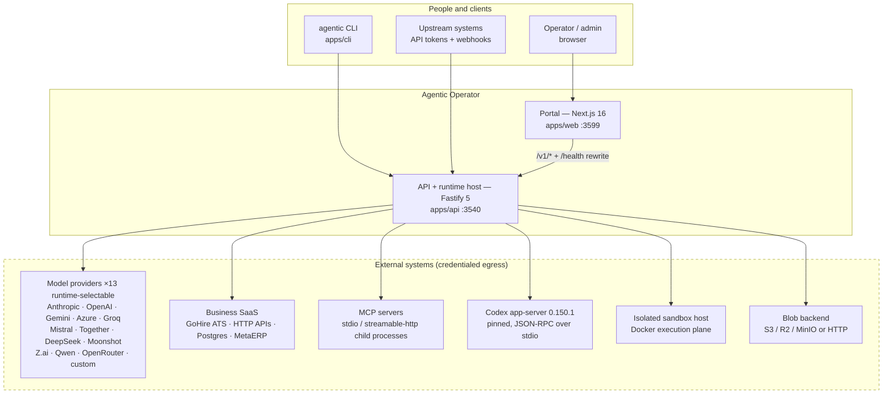

**Description.** The portal has **zero database access** — every read and write
goes over `/v1/*`, which `apps/web/next.config.mjs` rewrites to
`AGENTIC_API_URL`. Three client classes reach the API: browser sessions
(HttpOnly `agentic_session` JWT cookie), tenant-scoped bearer API tokens
(`apps/api/src/routes/v1/api-tokens.ts`), and inbound provider webhooks that
require a configured HMAC secret (`routes/v1/webhooks.ts`).

Outbound, the platform is deliberately fail-closed. A missing credential
surfaces as an explicit **integration gap** rather than a synthesized result;
`assertRealLLMGateway` in `apps/api/src/services/llm.ts` refuses to boot a
non-test API against a mock-like provider or model, and `/health` publishes
`llmGateway.mock` so one curl proves whether a stack is real.

---

## 2. Process / container view

What actually runs, on which port, holding which state.

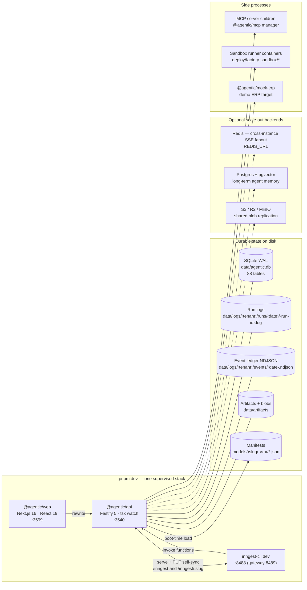

**Description.** `pnpm dev` boots exactly three supervised processes
(`concurrently` with `--kill-others-on-fail`); `predev` first kills stale
processes owned by this workspace. The API is the only writer of durable state.

**Inngest is one app per tenant.** `apps/api/src/routes/inngest.ts` serves the
base app at `/inngest` (the `__system` platform app, or `INNGEST_MAIN_TENANT`
when set) and every tenant app at `/inngest/:slug`, delegating to a **mutable**
handler held in `services/inngest-registry.ts`. That indirection is what lets a
deploy, an agent enable/disable, an archive, or a tenant onboarding swap a
served function set **without restarting the process**;
`services/inngest-sync.ts` reconciles apps with the broker via PUT self-sync.

The optional backends are config-flips, not rewrites: `fanout-redis.ts` reports
`redis` or `local` to `/health`; `blob-backend.ts` keeps local writes
authoritative and replicates content-addressed keys out to S3 asynchronously,
falling back to the backend on a local read miss.

Node is pinned to **26.8.1** to keep local, CI, and Docker runtimes consistent.
`better-sqlite3` must match the runtime's native-module ABI.
`scripts/ensure-native-modules.mjs` detects a mismatch via
`process.dlopen` and rebuilds in place; it is wired into `postinstall` and every
native-dependent `pre*` script.

---

## 3. Workspace dependency map

The package graph. Arrows point from consumer to dependency.

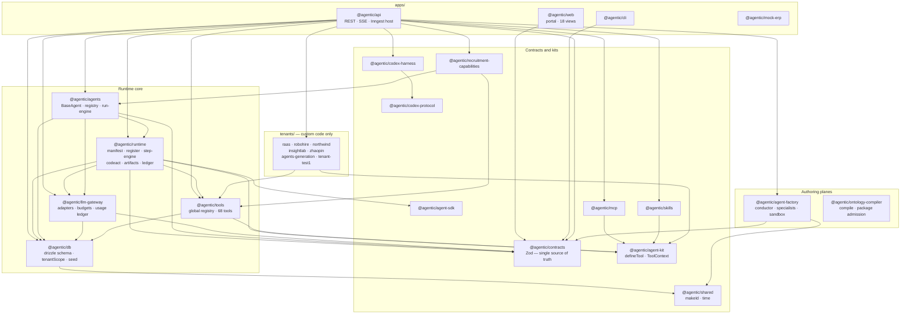

**Description.** `@agentic/contracts` is the spine: Zod schemas that the API
validates requests with and the portal parses responses with
(`apps/web/lib/api-client.ts`). One schema change is caught at both ends by
`pnpm typecheck`.

Two rules explain the shape of this graph:

- **Tenant wiring lives in `apps/api`, not in `@agentic/runtime`.** pnpm's
  isolated module resolution requires each package to own its own deps, so
  `TENANT_REGISTRIES` in `apps/api/src/bootstrap.ts` is where a tenant code
  package gets registered. `@agentic/runtime` stays tenant-agnostic.
- **New tools go in `packages/tools`, not in a tenant package.** Anything
  exported into `globalToolRegistry` is callable by any agent in any tenant. The
  remaining `tenants/*/src/tools/*.ts` files are ~3-line re-export shims kept
  for back-compat.

Two directories look like workspace members but are not: `packages/agent-runtime`
holds only build residue, and `apps/inngest-worker` is a Dockerfile plus an
entrypoint script — a container image definition, not a package.

A **manifest-only tenant needs no TypeScript at all** — drop
`models/<slug>-v<n>/`, add the tenant row, restart. Bootstrap auto-discovers it
and it runs on global tools.

---

## 4. The execution path — event to run

The core loop, from an inbound event to a persisted run and the next event.

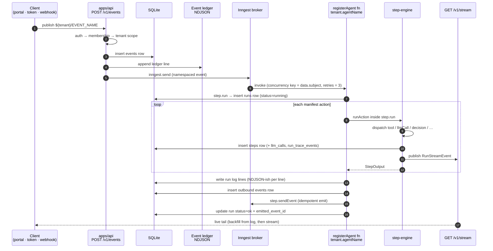

**Description.** `packages/runtime/src/register.ts` turns each `AgentSpec` in a
manifest into exactly one Inngest function:

| Property | Value |
| --- | --- |
| Function id | `${tenantSlug}.${agentName}` |
| Concurrency key | `event.data.subject` — one run per subject in flight |
| Retries | manifest `retries` (0–10), else 3 |
| Trigger | `${tenantSlug}/${eventName}`, or a transport adapter's external contract |
| Cancellation | `cancelOn` matching `${tenantSlug}/run.cancel` on the subject |

**Durability discipline** is the rule that makes this correct under replay.
Inngest replays handlers, so **every DB write must sit inside `step.run(...)`**
— that is what produces exactly one row per real execution. `step.sendEvent` is
the only idempotent emit; `inngest.send` inside a step body would duplicate on
replay. Human-in-the-loop follows the same shape: create the `tasks` row inside
`step.run`, then `step.waitForEvent("task.resolved", { if: 'async.data.taskId
== "…"' })`.

Two known operational edges, both documented in the code: Inngest **dev mode is
not crash-safe** (a `tsx watch` reload can drop an in-flight handler — re-fire
under a fresh subject), and `pnpm --filter @agentic/api run dev` alone does
**not** start Inngest, so `inngest.send` fails with `fetch failed`.

Three observability sinks are fed from the same execution records — SQLite rows,
the per-run NDJSON log, and the in-process broadcast channel
(`runtime/src/broadcast.ts`, keyed per `tenantId`) that `GET /v1/stream` and
`GET /v1/runs/:runId/logs?follow=1` turn into SSE. Subscribers that join mid-run
backfill from the persisted log, then stream. The UI keeps no second dataset.

---

## 5. Step engine and the tool trust boundary

How one manifest action becomes a real side effect.

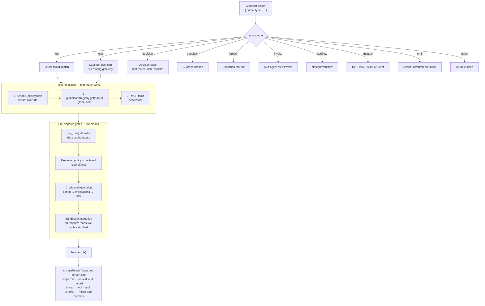

**Description.** `packages/runtime/src/step-engine.ts` implements ten action
types (`StepTypeEnum` in `manifest.ts`). Both the LLM tool-use loop and a direct
`type:"tool"` action resolve through the same three-tier lookup, so a tenant can
shadow a global tool while everyone else gets the default.

**Registration is not authorization.** A tool is callable only if the agent's
`tool_use[]` names it — that array is the trust boundary. A `tool_use[].config`
object is lifted into `ctx.config` on every handler call, which is how one
global tool serves many tenants with different credentials and paths:

```json
"tool_use": [
  { "name": "gohireParseResumeApi", "config": { "api_key_env": "TENANT_X_GH_KEY" } },
  { "name": "fs.readFromInbox",     "config": { "subdir": "resumes" } }
]
```

Tools are authored with `defineTool({ name, description, output?, handler })`
from `@agentic/agent-kit` — a plain descriptor, no DI, no decorators. Handlers
read LLM-supplied args from `ctx.event.data` (the runtime overrides `event` with
the tool-call input, so there is a single read site whether the LLM or a
manifest action invoked it). `ctx.lastResult` carries the previous tool's output
forward **server-side** — that is how a multi-KB base64 PDF passes from
`fs.readFromInbox` to a parser without the model re-quoting and corrupting it.

The catalog holds **35 registered tools across 18 categories**: `browser` (7,
Playwright-backed session/navigate/read/click/fill/screenshot/close), `gohire`
(5, the canonical ATS family), `fs` (4), `ontology` (3), `postgres` and
`records` (2 each), and one each of `http`, `comms`, `crypto`, `document`,
`search`, `viz`, `report`, `object-store`, `metaerp`, `robohire`, `config`, and
`meta`. A further **25 back-compat aliases** let older manifests keep working —
`fs.writeHtmlToArchive` still answers to `writeReportToDisk` and
`writeBriefToDisk`. One rule bounds aliasing: **never alias a real business
operation to a diagnostic probe**, because a missing integration must fail
closed rather than resolve to a ping.

`GET /v1/tools` serves this catalog and the portal's **Agentic Tools** page
renders it as API docs with copy-paste manifest snippets. Two directories under
`packages/tools/src` are infrastructure rather than tools: `integrations/` is
the DI seam through which `apps/api` injects the DB-backed credential resolver
(so `@agentic/tools` never imports the database layer), and `declarative/` holds
the declarative tool-spec machinery.

**CodeAct** is the fourth execution shape: generated `defineAgent` handlers run
in one of three isolation kernels — `worker_thread`, `isolated_subprocess`, or
`isolated_container` — with every stateful capability (reason, tool, memory,
invoke, spawn) crossing an explicit RPC bridge back to the host. Production
execution is denied without an opt-in flag **and** an exact SHA-256 attestation
of the code bytes (`runtime/src/codeact.ts`, `codeact-receipt.ts`).

---

## 6. LLM gateway and the usage ledger

Per-tenant model routing with mandatory attribution.

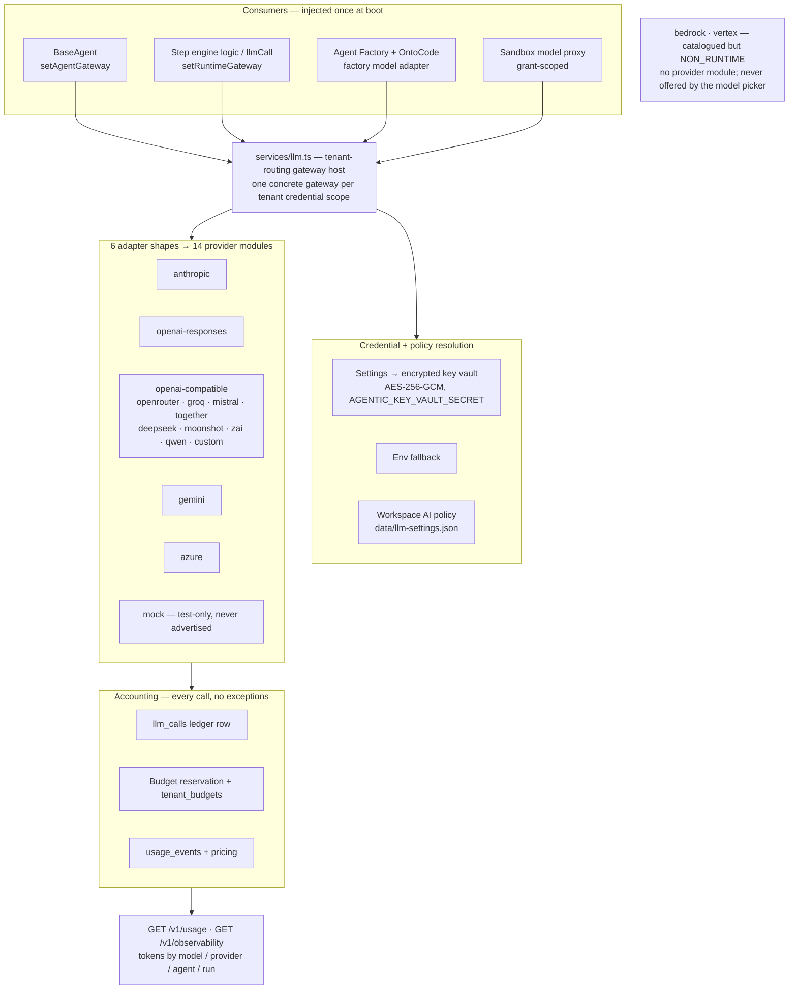

**Description.** Adapters capture credentials at construction, so
`apps/api/src/services/llm.ts` keeps **one concrete gateway per tenant
credential scope** and exposes a single stable routing gateway injected into
both consumers at boot (`bootstrap.ts`).

Every provider call is attributed and accounted.
`LLM_REQUIRE_USAGE_ATTRIBUTION=true` rejects an unattributable call outright,
and `runtime/src/usage-attribution-envelope.ts` threads attribution through the
event envelope so a cost can always be traced back to a tenant, agent, and run.

Two naming traps worth knowing when querying: migration
`0055_rename_llm_call_telemetry` renamed the old factory telemetry table
`llm_calls` → `llm_call_telemetry`, and the **usage ledger now owns the
`llm_calls` name**. They are different tables.

The provider catalog in `@agentic/contracts/providers` lists **16** ids, but
`NON_RUNTIME_PROVIDERS` in `apps/api/src/routes/v1/llm.ts` excludes three —
`mock`, `bedrock`, and `vertex` — leaving **13 runtime-selectable providers**.
`bedrock` and `vertex` have catalog metadata but no gateway provider module, and
the model picker never offers them; this is the README's "incomplete adapters
are not advertised by a non-test API" made concrete. The `mock` adapter exists
for tests and explicit sandbox verification only, and `/health` reports
`llmGateway.mock` so a stack cannot masquerade as real.

---

## 7. Authoring planes and the promotion pipeline

Four ways an agent comes into existence, converging on one gated release path.

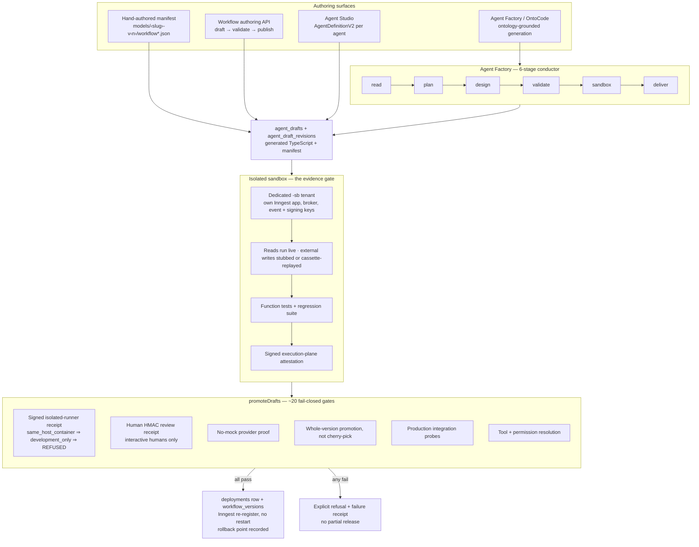

**Description.** All four surfaces converge on the same draft → sandbox →
promotion path. Nothing reaches a production tenant without passing every gate.

**Agent Factory** (`packages/agent-factory` — 115 modules against 142 test
files) is a conductor-driven
generation pipeline whose 6 stages drive the live canvas rail. Its notable
property is that the **stage filter derives the visible tool roster** — a tool
that cannot legally run at the current stage is not offered at all, rather than
being offered and refused after the model has already paid for it
(`conductor.ts:stageVisibleTools`).

**The sandbox is the hard boundary, and it is honest about it.** A local
`same_host_container` runner is permanently `development_only`, and `promote.ts`
refuses `allowDiagnosticSameHost`. Promotion therefore requires a genuinely
isolated runner with a signed attestation — the external Docker execution plane
in `deploy/factory-sandbox/`. This is by design: a sandbox that could vouch for
itself would vouch for nothing.

The other gates are governance, not obstacles: an HMAC review receipt only an
interactive human can sign, a no-mock proof, whole-version promotion (never
cherry-picked agents), live production integration probes, and full tool and
permission resolution.

Release is hot. `services/inngest-registry.ts` swaps the served function set for
one app in place, and `deployment-rollback.ts` keeps the prior version
recoverable.

---

## 8. OntoCode session and harness jobs

The ontology-driven authoring plane: a durable, resumable, human-gated session.

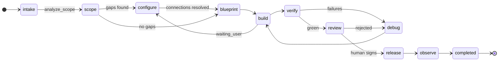

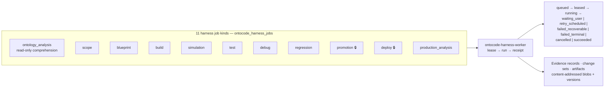

**Description.** OntoCode compiles a business **Ontology** — Actions, Events,
DataObjects, Rules — into deployable agents, and it persists as a first-class
durable object: `ontocode_projects` → `ontocode_sessions` → jobs, commands,
change sets, artifacts, evidence records, and a purge trail, across 20+ tables.

A single worker (`services/ontocode-harness-worker.ts`) leases jobs and runs
them. `promotion` and `deploy` are marked `PRODUCTION_JOB_KINDS` and carry the
full gate set from §7. `waiting_user` is a first-class terminal-ish state, not
an error — the session parks and resumes when a human answers.

The **Ontology Analyst** job kind exists because of a concrete root-cause
finding recorded in `docs/ontocode-status-2026-07-28.md`: `read_ontology` was
handing the model `links: <count>` — a single integer — after loading the
compiled relationship graph into memory and discarding it. On a live domain that
graph is 580 evidence-bearing edges across 13 relationship types. The model had
simply never seen it. The fix is guarded by tests that enforce honesty: **every
ontology id the model cites is looked up, and an id that does not exist is
downgraded to "unverified."** Substrate reporting is tri-state, distinguishing
"could not look" (`not_configured`, `unsupported_by_source`) from "looked and
found nothing" (`empty`) — which is why the Analyst reports Neo4j as
`not_configured` rather than silently returning zero rows from a predicate
mismatch.

A separate, deliberately **non-runtime** boundary handles immutable third-party
ontology packages: `packages/ontology-compiler/src/package-admission.ts` and
`scripts/ontology-package-inspect.mjs` validate an envelope plus its family
schemas, verify family/package hashes and workflow/subflow pins against three
exact trust pins, and emit an explicitly **non-deployable** shadow receipt. It
refuses aliased outputs and runtime `models/` roots, and never imports a
manifest or registers a workflow.

---

## 9. Storage and the system of record

Where each kind of state lives, and why it lives there.

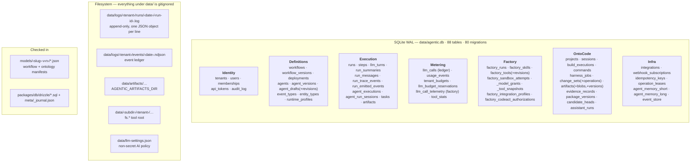

**Description.** SQLite in WAL mode is the system of record. **Every
user-visible table carries `tenant_id`**, and the predicate must be built with
`tenantScope(ctx, table)` from `@agentic/db` — a raw `getDb()` query leaks
across tenants. IDs are prefixed strings from `makeId(prefix)` (`run-…`,
`evt-…`, `agt-…`, `tsk-…`); timestamps are unix-ms.

Run logs are deliberately **not** in the database: append-only per-run files
make the SSE tail cheap and let a run's history survive independently of row
retention. The same records feed SQLite, the log files, SSE, and the
observability APIs — there is exactly one dataset.

Migrations are **hand-authored** in this repo (`db:generate` hangs on an
incomplete snapshot chain), which makes `meta/_journal.json` load-bearing: it
once silently dropped 11 of 17 entries and had to be rebuilt. Treat it as code.

The `fs.*` data root resolves `AGENTIC_DATA_ROOT` → `pnpm-workspace.yaml`
walk-up → `<cwd>/data`. `AGENTIC_DATA_ROOT` is deliberately **unpinned** and the
walk-up is the live mechanism: a root-`.env` pin of `./data` would win env-file
layering and resolve against the API's cwd to `apps/api/data/` — the exact
stranding bug the pin was meant to prevent. Artifacts are pinned instead, via an
identical cwd-relative `AGENTIC_ARTIFACTS_DIR=../../data/artifacts` in both env
files.

Two destructive maintenance paths exist and are scoped: `db:wipe-runtime`
truncates runtime traffic (runs, steps, events, tasks, audit, artifacts) while
preserving identity and configuration; `db:prune-deployments` GCs superseded
deployment rows and their import tmp dirs.

---

## 10. Security and trust boundaries

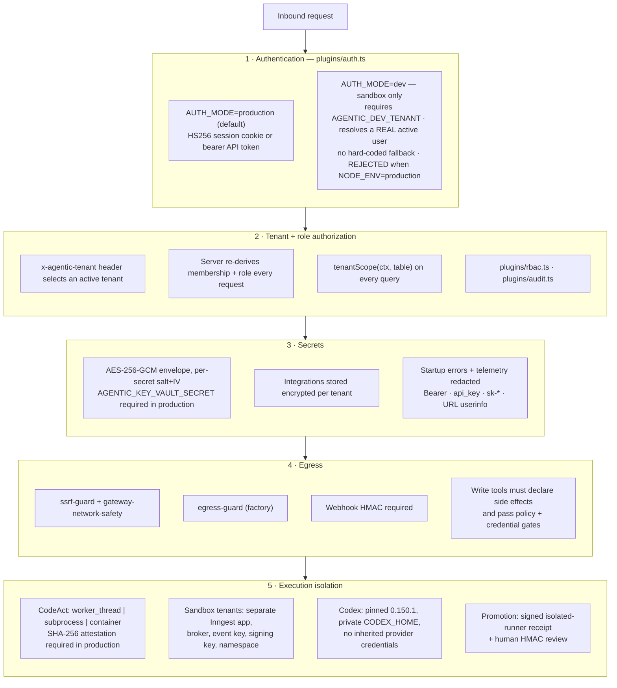

**Description.** Five layers, each fail-closed.

The **`AUTH_MODE=dev` footgun** is explicitly defused: it requires
`AGENTIC_DEV_TENANT`, resolves a real active database user (there is no
hard-coded user or tenant fallback), and the process refuses to start with
`NODE_ENV=production` — because in that combination every unauthenticated
request would become an authenticated one.

Tenant identity **always** comes from the authenticated principal. The
`x-agentic-tenant` header only selects among tenants the server independently
confirms the principal belongs to.

`pnpm db:seed` provisions tenant rows and exactly one bootstrap superadmin from
three mandatory env vars (`AGENTIC_BOOTSTRAP_ADMIN_EMAIL`, `_NAME`,
`_PASSWORD`). **The repository ships no default account and no sample
identities.** Further users are created through the authenticated Access
surface.

The runtime contract in the README is enforced, not aspirational: real provider
for every run, no demo mode, external systems reached only through configured
tools or MCP servers, missing credentials surfaced as an explicit gap, and
deterministic adapters/fixtures/replay stubs confined to tests and explicit
sandbox verification.

---

## Verification commands

```bash
curl --fail http://localhost:3540/health   # ok:true and llmGateway.mock:false
pnpm typecheck && pnpm lint && pnpm test && pnpm build
pnpm codex:protocol:check && pnpm verify:codex-harness
pnpm --filter @agentic/api verify:observability
```

`verify:observability` is an isolated canary labelled as a test run. It uses the
configured real default provider (refusing mock), then verifies persistence, run
logs, SSE replay, `llm_calls`, token accounting, and agent-call aggregation —
without claiming that any external business action occurred.

---

## Reading the code from here

| Question | Start here |
| --- | --- |
| How does an event become a run? | `packages/runtime/src/register.ts` |
| How is one action executed? | `packages/runtime/src/step-engine.ts` |
| How do I add a tool? | `packages/tools/src/registry.ts` (`REGISTRATIONS`) |
| How is a tenant wired? | `apps/api/src/bootstrap.ts` (`TENANT_REGISTRIES`) |
| What is the API surface? | `apps/api/src/server.ts` → `routes/v1/*` |
| What is the data model? | `packages/db/src/schema.ts` |
| What crosses web↔api? | `packages/contracts/src/*` |
| How is an agent generated? | `packages/agent-factory/src/conductor.ts` |
| How is a release gated? | `apps/api/src/services/agent-factory/promote.ts` |
