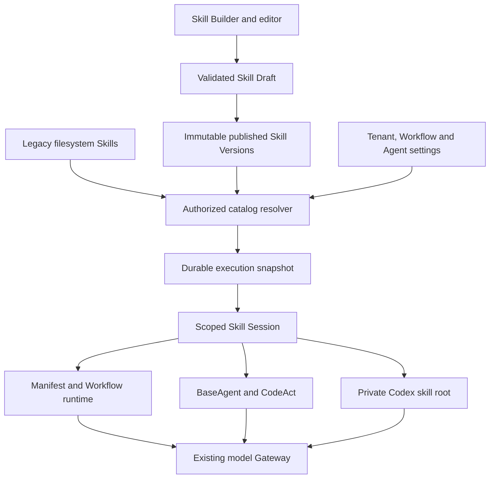

# Skills runtime and Skill Builder

Status: implemented and verified, 2026-09-09. Research,
managed libraries, portable bundles, execution sessions, Creator generation,
file editing, evaluations, import/export and harness integrations are present.
This document describes the full intended outcome; the
[implementation status](skills-implementation-status.md) distinguishes working
code and verified evidence from remaining work.

## Outcome

An operator describes a capability, reviews a generated Skill in a file editor,
tests it, and publishes it for Agents to use. The same Skill can be exported as
a standard bundle, imported elsewhere, or used by another Workflow without
rewriting prompts or adding a Tenant TypeScript package. Skills work through
the existing Gateway across configured Providers.

The user requested all of these together:

1. Natural-language creation using a maintained Skill Creator informed by
   Anthropic's authoring practices; generated content opens in an editor.
2. Create, edit, maintain, import and export Skills and supporting files.
3. Skills integration in Workflows, Manifest Agents, Code Agents, CodeAct
   subagents and the Codex Harness where it executes platform work.
4. Availability throughout the runtime, including declarative-only Tenants.
5. Research against Anthropic, DeepSeek Harness, Codex Harness and pi.dev.
6. Architecture documentation, a user guide and contextual online help.

Primary-source findings and links belong in
[the research note](../research/2026-09-09-skills-and-agent-harnesses.md).

## Implementation defaults

Tenant-owned libraries are visible to that Tenant's Agents and Workflows.
Superadmins can maintain an explicitly shared platform library. Operators save
editable drafts and publish immutable versions; bindings may follow the latest
publication or pin a version. These are the recommended defaults stated to the
user during implementation, not answers inferred from an unanswered question.
They preserve tenant isolation and reproducible runs while keeping the product
policy reviewable. The task authorizes implementing the feature; these
reversible defaults do not require a separate permission gate.

## Existing implementation and compatibility

The prior `@agentic/skills` implementation discovered filesystem `SKILL.md`
descriptors and provided `skills.list_skills` and `skills.load_skill`. Its
permissive parser and mutable body reads have been replaced by validated,
byte-preserving bundles and bounded per-execution sessions. Compatibility tools
capture immutable source bytes. The managed resolver supplies published
Tenant and shared Skills even for declarative-only Tenants. The nine checked-in
Skills in Northwind, InsightLab and RoboHire remain compatible, with validated
bytes captured through the common resolver. Legacy named Tool aliases remain
available; model-facing session tools advertise a single required Skill ID.

Factory Skills are a separate concept: learned authoring guidance with
effectiveness scoring and domain governance. Keep those records and behavior.
Provide an explicit **Copy to Skill Library** conversion into a draft. Neither
Factory induction nor import publishes executable instructions automatically.

The current working tree includes substantial pre-existing runtime, Workflow
authoring and UI work. Implementation must be additive to that tree and must
not reset, replace or silently discard those changes.

## Portable Skill bundle

A Skill uses the Agent Skills directory convention:

```text
skill-name/
  SKILL.md
  references/       # optional, read when relevant
  assets/           # optional templates and output resources
  scripts/          # optional executable helpers
  agents/           # optional harness metadata preserved on round-trip
```

`SKILL.md` contains valid YAML frontmatter with `name` and `description`, followed
by Markdown instructions. Preserve compatible optional fields and additional
resources rather than flattening a bundle into a prompt fragment. The folder
name and declared name must agree when importing a folder-rooted archive.

The core library owns parsing, deterministic hashing, validation and portable
archive round-trips. The contracts package owns API and assignment schemas.
Neither the web application nor a model chooses filesystem paths on the host.

Admission requirements:

- Parse actual YAML with bounded alias expansion. Reject duplicate identity
  keys, invalid metadata, empty instructions and invalid names.
- Normalize portable relative paths. Reject absolute paths, traversal,
  backslashes used as separators, drive prefixes, control characters, links,
  duplicate entries, and case collisions that cannot round-trip on the host.
- Bound archive size, expanded bytes, individual files, file count, compression
  ratio, depth and resource reads. Check before allocating expanded content.
- Preserve binary assets by bytes. Treat text encoding explicitly. Never
  execute scripts, render raw HTML, install dependencies or fetch referenced
  URLs while importing, previewing or publishing.
- Produce structured errors and warnings with file locations. Warnings include
  excessively long instructions, unresolved relative references, missing tool
  dependencies and compatibility metadata the selected harness cannot honor.
- Support a portable ZIP and a standalone `SKILL.md`; offer a folder upload
  using the same validation. Exporting Markdown alone clearly excludes bundled
  resources. A ZIP round-trip preserves every admitted file's bytes.

Use a canonical sorted file manifest and content digest. API JSON encoding is
an internal transport, not a replacement for the portable folder format.

## Library and lifecycle

Use new managed records rather than overloading `factory_skills`:

- **Skill identity**: stable id, owning Tenant, canonical name, visibility,
  current published version pointer, archive state and timestamps.
- **Skill Draft**: editable bundle, monotonically increasing revision,
  validation result and generation/import provenance.
- **Skill Version**: immutable bundle snapshot, version id/number, digest,
  publication attribution and timestamp.
- **Skill evaluation**: selected draft revision or published version, examples,
  run references, observed results and operator/model review provenance.

Every record retains an owning `tenant_id`. Shared entries have
the platform's `__system` owner and an explicit shared visibility. Shared
visibility is never inferred from an omitted Tenant filter. Private drafts,
evaluations and history do not become public merely because a published
version is shared.

Tenant names shadow shared names for automatic discovery. Stable ids and
version bindings disambiguate explicit selections. The UI displays the owner
and source. A user without shared-library write permission can copy a shared
Skill into their own library.

Lifecycle:

```text
describe / blank / import / copy
              ↓
      editable draft → validate → evaluate → publish version
              ↑                                 ↓
       revise or restore                 available to new runs
```

Evaluation is recommended; structural validation is required. Publishing
compares the exact draft revision and content digest validated by the operator.
Saving and generation use optimistic concurrency: a response based on revision
4 cannot overwrite revision 5. Reopening a historical version creates a new
draft; it does not mutate that version or rewrite past Runs.

Archive removes ordinary new-run discovery while retaining history and pinned
in-flight access. A newly started Run must not silently revive an archived
Skill through an old binding; fail with a useful diagnostic. Existing Runs and
their retries retain their original snapshot. A separate emergency revocation,
if exposed, must be an explicit operator action checked on every activation
and resource/script access, with a visible failure in affected Runs.

Publish, archive and restore are transactional, audited and available without
an API restart. No successful response may depend on a best-effort audit write.

Retain versions referenced by Runs, Workflow snapshots, published Agent
bindings or evaluations. Garbage collection must check these references;
archiving an owner or clearing an editor draft cannot delete replay inputs.
Import name conflicts offer explicit rename/copy/update-draft choices, never
a silent overwrite. Publishing a broadly available Skill shows its future
scope of use before committing the version.

## Skill Creator and editing experience

The portal adds **Skills** next to **Agentic Tools**. Its primary actions are
**Describe a skill**, **Create blank**, and **Import**. The library shows the
name, purpose, ownership, draft/published state, published version and usage.
Search, source/status filters and an honest empty state make larger libraries
manageable. No synthetic catalog rows are inserted into production.

The maintained platform Skill Creator is itself a versioned instruction
bundle. It teaches concise capability descriptions, discriminating activation
conditions, progressive disclosure, useful examples, output expectations,
error recovery and verification. It uses only capabilities available to the
target platform. It does not bake Claude CLI commands or Anthropic-only model
features into provider-neutral user Skills.

Creation accepts the user's requested capability, optional examples, selected
Model Route, and permitted tool/catalog context. The existing tenant Gateway
performs the call with Usage Attribution, real provider errors and bounded
generation/repair attempts. No mock response or template is silently substituted
for failed AI generation. Store the creator policy version, requested/served
model, assumptions, validation issues and generation timestamp.

An omitted Model Route uses the host's explicit Pro authoring default, not the
general tenant chat route. `SKILL_CREATOR_MODEL_ROUTE` can select a configured
Pro route; for a native OpenAI base model, also set
`SKILL_CREATOR_REASONING_MODE=pro`. Default Pro calls use high reasoning, a
16,000-token output cap and a five-minute timeout. The same route handles the
single permitted format repair. Pro results must identify a Pro model or Pro
reasoning mode in the raw provider response, retained separately from normalized
controls in generation provenance. Deliberate
editor route choices remain available; provider failures never cause a switch
to an unrelated model. These settings choose authoring compute and do not
establish that generated Skills are behaviorally superior.

After validation, persist the generated draft and open that exact revision in
the editor. The user can immediately change instructions and supporting files.
For an existing draft, AI revision proposes a reviewable change against the
starting revision; concurrent user edits remain intact.

Editor layout:

- File tree with `SKILL.md`, references, scripts and assets.
- Text editor and safe Markdown preview; binary metadata/download for assets.
- Validation issues linked to files and fields.
- Draft/published indicator, unsaved-change state, save, validate, test,
  publish, export, version history and help.
- Add, rename, replace and remove files through the same server validation.
- Model picker reusing the configured model fleet. Errors remain visible and
  preserve the user's input.

Reuse the portal's editor, Markdown component, dialog behavior and CSS tokens.
Provide keyboard labels, focus management, responsive layouts and English/
Chinese copy consistent with the existing portal. Gate controls using the same
permissions enforced by the API; hiding a button is never authorization.

## Assignments, discovery and activation

A published Skill is available to all authorized Agents and Workflows; it is
not automatically loaded in full into every prompt. The binding schema needs
to express:

- Inherit the parent/tenant catalog.
- Restrict to selected Skills, with latest-published or explicit version pins.
- Disable Skills for this Agent or Workflow.
- Explicitly activate a selected Skill when a deterministic Workflow needs it.

Workflow defaults feed Agent settings. Child scopes can narrow an inherited
catalog; they cannot gain Skills or Tools the caller is not authorized to use.
The editor explains inheritance, source and pinning and preserves bindings
through normalization, draft save/load, publish, import/export and Test Lab.

The host builds a **Skill Session** for an execution from authorized immutable
version references. The session provides bounded metadata discovery, activation
and resource reads. Advertise names/descriptions first, load instructions only
when selected, then read supporting resources only when needed. A large catalog
must have bounded discovery and pagination rather than unbounded prompt growth.

Reserve the intrinsic Skills operations for host-owned read access. Existing
`skills.list_skills` and `skills.load_skill` remain compatible names; resource
read/list operations complete progressive disclosure. An arbitrary Tenant tool
cannot impersonate these operations and bypass their session scope.

Skill availability is distinct from the Tool Allow-list. Frontmatter such as
`allowed-tools` never grants credentials, Tools, network, filesystem access or
subagent privileges. Preserve `agent.tool_use ∩ action.allowed_tools` for
business Tools. Any supported restriction metadata may narrow that set; it
cannot enlarge it. Unsupported invocation-policy metadata must be visibly
reported rather than silently promising enforcement.

Active instructions live outside the ordinary tool-result history so context
folding cannot erase them. They are reintroduced as bounded, identified skill
guidance when preparing each model turn. Skill text is subordinate to the
Agent's task and host policy. Resource bodies and scripts are not all injected
on activation. Bound active skill count, cumulative tokens and resource bytes;
return clear errors when an operation would exceed the configured budget.

## Durable execution and all harness paths



Resolve latest-published selectors once at the execution boundary, and persist
only immutable version references/digests as the durable snapshot. Never store
the entire library in an Inngest step payload or resolve a mutable published
pointer independently in each Action.

For Manifest Agents, the existing `step.run("init")` in `register.ts` is the
preferred capture point. Store a create-once Run Skill Snapshot and return its
id/digest with the Run id. On replay, reload and verify that snapshot rather
than selecting current publications. Store activation references in Action
results so subsequent Actions can reconstruct active guidance after process
restart. Snapshot legacy filesystem contents, not just mutable file paths.

Within a Workflow execution, reuse the root snapshot for internal handoffs,
subflows and subagents, intersected with each recipient's settings and current
Tenant authorization. Establish lineage from trusted run/dispatch records;
untrusted event payload fields must not choose a private Skill or a snapshot.
A new independent external Event begins a new snapshot. Retries and resumed
human Tasks retain the original snapshot. Distinguish a replay using original
versions from an intentional fresh Run using current versions.

| Execution path | Required integration |
| --- | --- |
| Manifest Agent | Capture refs inside durable initialization; inject session into ordinary and nested Action carriers and shared prompt/tool assembly |
| Workflow and Test Lab | Use the same resolver, binding interpretation, session operations and trace format as production |
| Code Agent / BaseAgent | Add session preparation to the sealed run engine; support load/answer turns despite the current single-turn default without changing ordinary no-skill Agents |
| CodeAct | Host-mediated Skill access through the RPC boundary; active guidance in `reason`; scoped, pinned inheritance for permitted children |
| Codex Harness | Materialize only authorized versions into its private skill root; use pinned app-server discovery and explicit skill input types |
| Factory authoring | Expose managed published guidance where appropriate and copy learned Factory Skills into reviewable managed drafts |

Keep the existing production prohibition on ephemeral CodeAct spawning. Skills
do not enable an execution mode that was disabled by platform policy.

The local Codex pin is `0.150.1`. Its generated protocol supports `skills/list`
with `cwds` and `forceReload`, skill config writes, and explicit skill user
input. Current documentation also describes newer extra-root parameters which
are absent from this pin. Do not hand-edit protocol bindings or send unsupported
fields. Verify materialization and discovery with the actual pinned binary.

For DeepSeek and other Providers, preserve the existing Gateway's complete
tool-call and opaque reasoning transcript rules. Research the external
harnesses for design principles; the platform does not need to replace its
runtime with four separate provider-specific execution engines.

Trace catalog resolution, exact version/digest, activation, resource reads,
dependency failures and script execution evidence. Include attribution to
Agent, Run, Step and parent where applicable. Avoid recording secret contents
or unrestricted absolute host paths in model-visible results.

## Bundled scripts

Portable Skills can contain scripts. Importing and publishing preserve them;
execution is an additional reviewed capability. No imported or AI-written
script executes inside the API process or an unisolated host shell.

The existing CodeAct container runner provides Docker transport, resource
limits, lifecycle and cleanup evidence, but its protocol and image execute
Node Agent modules. It does not provide a general Python/Node Skill script
runner. Implement a separate bounded script protocol and pinned runner image,
reusing isolation machinery without weakening the CodeAct execution contract.

The script runner must:

- Execute an admitted file from the session's immutable bundle, with an
  allowlisted interpreter and explicit arguments; never accept a shell command
  string assembled from untrusted input.
- Run as a non-root user with no host mounts, Docker socket, inherited secrets
  or network by default; use a writable scratch area with byte limits.
- Enforce CPU, memory, process, timeout, input/output and artifact limits, and
  propagate cancellation. Remove the container and verify cleanup.
- Require a server-approved pinned image and explicit Agent execution
  capability. Dependency installation does not run as an import side effect.
- Pass any approved business operation through existing host tool
  authorization. A Skill's metadata cannot authorize external side effects.
- Return bounded stdout/stderr, exit status and generated artifacts with
  execution evidence linked to the Run and version digest.

Report script-runner availability in the editor and at runtime. If its image
or execution policy is not configured, instructions and resources remain
available, but script execution returns an actionable capability error. Do not
claim the script ran or fall back to an unsafe runner.

## API and authorization

Add a dedicated tenant-authenticated `/v1/skills` API, using shared Zod schemas
and the existing API client. Cover catalog/detail, draft create/update,
validation, AI generation/revision, evaluations, publish, archive, version
history/restore, and import/export. Binary responses carry safe filenames and
the correct media type. ZIP upload limits apply before body parsing as well as
during archive admission.

Use dedicated `skills.read`, `skills.write` and `skills.publish` permissions
mapped consistently to the existing role matrix, with superadmin required for
shared-library mutations. Resolve Tenant identity from authenticated context,
not request body fields. Export, history, asset downloads and error messages
must enforce the same visibility as detail and runtime access.

Every mutation records actor, owner, target id, revision/digest and operation.
Generation is attributed and bounded; disconnects/cancellation must not report
a completed draft before persistence. Conflicts return the current revision
and retain user work. Publishing and restoring must check visibility and
authorization at commit time, not only when a dialog opens.

## Evaluation and verification

The Creator proposes a few realistic examples and should/should-not-activate
cases. The operator can edit them and execute bounded comparisons with and
without the selected Skill through the actual tenant Gateway. Keep expected
behavior separate from model observations and distinguish deterministic
assertions, model judgments and human review. A successful structural validator
does not establish that a Skill helps an Agent.

Required implementation verification:

1. Valid YAML and binary bundle round-trip; malformed metadata, archive
   traversal, links, duplicate/case-conflicting paths and decompression limits.
2. Tenant/shared isolation across list, detail, export, history, generation,
   activation and resource/script access; no client-selected Tenant bypass.
3. Concurrent save/generation/publish conflicts; published content immutable;
   archive/restore preserve prior version evidence and replay behavior.
4. Latest selectors captured once; mid-run publication cannot change an
   Action, retry, resumed Task or internal child; untrusted events cannot
   supply a privileged snapshot.
5. Progressive disclosure and retained activation after history folding;
   catalog and resource budgets enforced without silently dropping guidance.
6. Normal/nested Manifest Actions, Workflow Test Lab, BaseAgent, CodeAct
   reasoning/children and actual pinned Codex discovery.
7. Skill metadata and child requests cannot widen business Tool permissions;
   portable scripts execute only under the configured isolated capability.
8. Real builder request produces a draft opened in the editor; invalid/failed
   model output preserves input and never masquerades as success.
9. Bindings survive both Studio and Workflow editing and publish round-trips;
   import/export works through the portal with byte-preserving resources.
10. Keyboard/focus, responsive layout, read-only controls and online help are
    verified in the real browser, with a documented user journey.

Tests use isolated databases and temporary files. Production pages receive
only real catalog records and real run results. Avoid modifying existing
Tenant data or interrupting active work merely to create a demonstration.

## Documentation and delivery

Deliver this design updated to actual behavior, the cited research note, a
short ADR for the versioned provider-neutral execution boundary, and glossary
entries for Skill, Skill Draft, Skill Version and Skill Session. Keep Factory
Skill distinct in the glossary.

The user guide at `docs/user-guides/skills.md` must cover first creation,
effective descriptions, files/resources, validation and testing, publishing,
pinning/inheritance, import/export, sharing, history/restore, script capability
setup, supported harness behavior and troubleshooting. Include complete
examples that work against the implemented API.

Add contextual **Help & examples** in the library/editor and assignment
controls, with links from Agent Studio and Workflow help. User-facing help
must match implemented behavior and explicitly explain unavailable
capabilities instead of describing a future design as shipped.

Implementation work can be split into core/contracts and execution sessions;
DB/API/Creator lifecycle; library/editor/help; and cross-runtime integration,
assignment UI, documentation and end-to-end verification. Integrate against
the existing uncommitted work, use Node `26.8.1`, and run appropriate affected
package checks before broader workspace checks.
